###强化学习算法学习和实验报告

**课程名称**：REINFORCEMENT LEARNING - 2509-BSAI402EX1-6D3A1E

**项目类型**：课程项目报告

**完成日期**：2026年1月3号

**组员信息及贡献分配**：

| 姓名 | 学号 | 贡献比例 |
|------|------|----------|
| Zhang Ruizhe | 1230017665 | 35% |
| Zhong Junhan | 12300 | 20% |
| Guo Yujia | 12300 | 15% |
| Wu Yuze | 12300 | 15% |
| Yu Jiaziyu | 12300 | 15% |
---


*Mathematical Foundations of Reinforcement Learning*

---

# 目录

1. [引言](#1-引言)
   - [1.1 研究背景与动机](#11-研究背景与动机)
   - [1.2 研究目标](#12-研究目标)
   - [1.3 相关工作](#13-相关工作)
2. [方法](#2-方法)
   - [2.1 总体技术路线](#21-总体技术路线)
   - [2.2 环境选择与实现](#22-环境选择与实现)
   - [2.3 预训练与环境验证](#23-预训练与环境验证)
   - [2.4 关键设计决策与设计思路](#24-关键设计决策与设计思路)
   - [2.5 算法原理与实现详解](#25-算法原理与实现详解)
   - [2.6 质性分析与理论预测](#26-质性分析与理论预测)
   - [2.7 PPO性能优化](#27-ppo性能优化)
   - [2.8 评估方法](#28-评估方法)
3. [结果与讨论](#3-结果与讨论)
   - [3.1 基线算法实验结果](#31-基线算法实验结果)
   - [3.2 PPO-SOTA 训练结果](#32-ppo-sota-训练结果)
   - [3.3 PID 控制器执行层优化效果](#33-pid-控制器执行层优化效果)
4. [结论](#4-结论)
   - [4.1 算法选择理由总结](#41-算法选择理由总结)
   - [4.2 关键成功因素](#42-关键成功因素)
   - [4.3 从基础到SOTA的演进](#43-从基础到sota的演进)
   - [4.4 主要贡献与发现](#44-主要贡献与发现)
   - [4.5 未来改进方向](#45-未来改进方向)

---

# 1. 引言

## 1.1 研究背景与动机

本项目旨在通过实践来深入理解《Mathematical Foundations of Reinforcement Learning》教材中的强化学习理论。我们选择通过复现多种经典的强化学习算法，并在统一的仿真环境中进行对比实验，以验证理论知识在实际应用中的效果。

**核心动机：**

- **环境构建实践**：通过动手搭建，理解如何从零构建一个标准的强化学习训练环境（主要构件强化学习算法部分）。
- **算法深度理解**：通过代码实现加深对算法核心逻辑的理解。
- **特性与适配研究**：探索不同算法（On-policy vs Off-policy，Value-based vs Policy-based）在相同环境下的表现差异，理解算法特性与环境的适配关系。
- **为什么这么做**：对于基础算法，已经存在大量研究，所以这里将重点放在学习算法上面。

## 1.2 研究目标

尝试在现有课程基础上尝试在Car Racing上取得尽量好的分数。

本项目设立了层层递进的四个目标：

- **目标1（基准构建）**：尝试构造并复现Double DQN、N-step SARSA、REINFORCE、A2C、DDPG、PPO等基础算法，确立一个基本的Baseline（目标Reward > 400）。
- **目标2（质性分析）**：分析各个算法的优劣，并将实验结果与理论猜想进行对比验证。
- **目标3（冲击SOTA）**：在筛选出的最优算法基础上进行魔改和优化（添砖加瓦），尝试冲击高分。
- **目标4（探索与试错）**：鼓励在学习过程中尝试不同的技术路线，即使失败也能从中获得宝贵的经验（即"为了学习而折腾"）。

## 1.3 相关工作

### 1.3.1 CarRacing 环境的强化学习研究

CarRacing-v2/v3 是 Gymnasium（原 OpenAI Gym）的标准连续控制基准环境，被广泛用于评估强化学习算法在视觉输入和连续动作空间下的性能。该环境模拟了一辆赛车在随机生成的赛道上行驶的任务，要求智能体学会在保持速度的同时安全过弯，避免冲出赛道。

**经典基准测试**：
- CarRacing 环境最初由 OpenAI 在 2016 年提出，作为 Atari 游戏环境的连续控制扩展 [1]。
- 该环境的主要挑战包括：稀疏奖励（只有触达路块才得分）、长序列依赖（需要规划整个赛道）、以及需要精细的连续控制策略（转向、油门、刹车的协调）。

**SOTA 方法**：
- 当前 CarRacing 环境的 SOTA 方法主要基于 PPO（Proximal Policy Optimization）算法，结合奖励重塑（Reward Shaping）和精细的超参数调优 [2]。
- 研究表明，基于赛道几何信息的奖励重塑（如中心线引导、速度投影）能显著加速训练并提升最终性能 [3]。
- 执行层优化技术（如 PID 控制器）在机器人控制和自动驾驶领域的成功应用，为强化学习在连续控制任务中的应用提供了重要参考 [4]。

### 1.3.2 策略梯度方法的发展历程

策略梯度方法是强化学习中的核心算法家族，其发展历程体现了从理论到实践的不断优化。

**REINFORCE 算法**：
- Williams (1992) 提出了最早的策略梯度方法 REINFORCE，使用蒙特卡洛回报估计策略梯度 [5]。
- REINFORCE 的核心思想是直接优化策略参数，通过采样轨迹的回报来估计梯度。
- 虽然简单直观，但 REINFORCE 存在高方差问题，在长序列任务中难以收敛。

**Actor-Critic 方法**：
- 为了降低方差，研究者引入了价值函数作为 Baseline，形成了 Actor-Critic 方法 [6]。
- A2C (Advantage Actor-Critic) 使用 n-step 回报估计优势函数，比 REINFORCE 方差更小，收敛更稳定 [7]。
- Actor-Critic 方法通过共享特征提取器，实现了参数效率和训练稳定性的平衡。

**PPO 算法**：
- Schulman et al. (2017) 提出的 Proximal Policy Optimization (PPO) 通过 Clipping 机制实现了稳定且高效的策略优化 [8]。
- PPO 的核心创新是使用重要性采样比率裁剪，限制策略更新幅度，避免策略崩溃。
- PPO 结合了 GAE (Generalized Advantage Estimation) 和多 Epoch 训练，在样本效率和稳定性之间取得了最佳平衡，成为当前最流行的 On-Policy 算法。

**DDPG 算法**：
- Lillicrap et al. (2015) 提出的 Deep Deterministic Policy Gradient (DDPG) 将 DQN 扩展到连续动作空间 [9]。
- DDPG 使用确定性策略和 Actor-Critic 架构，通过经验回放和目标网络实现 Off-Policy 学习。
- 虽然理论上限高，但 DDPG 对超参数敏感，在高维视觉输入下容易出现训练不稳定问题。

### 1.3.3 值函数方法在连续控制中的应用

**DQN 系列算法**：
- Mnih et al. (2015) 提出的 Deep Q-Network (DQN) 首次将深度学习成功应用于强化学习 [10]。
- Van Hasselt et al. (2016) 提出的 Double DQN 通过解耦动作选择和动作评估，解决了 Q 值过估计问题 [11]。
- 虽然 DQN 系列在离散动作空间任务中表现出色，但在连续控制任务中，动作空间的离散化会导致精度损失和"锯齿状"轨迹。

**时序差分学习**：
- SARSA (State-Action-Reward-State-Action) 作为 On-Policy 的时序差分方法，学习实际执行策略的价值函数 [12]。
- 相比 Q-Learning 的 Off-Policy 特性，SARSA 在探索阶段更加保守，但在某些任务中可能陷入局部最优。

### 1.3.4 奖励重塑与执行层优化

**奖励重塑（Reward Shaping）**：
- Ng et al. (1999) 从理论上证明了奖励重塑不会改变最优策略，只要满足势能函数条件 [13]。
- 在 CarRacing 等连续控制任务中，基于领域知识的奖励重塑（如几何引导、速度奖励）已被证明能显著加速训练 [3]。
- 我们的工作在此基础上，提出了更精细的奖励重塑机制，包括有效进度奖励、中心线势能场、以及抗抖动惩罚。

**执行层优化**：
- PID（Proportional-Integral-Derivative）控制器是经典的控制理论方法，广泛应用于工业控制和机器人领域 [14]。
- 在强化学习中，执行层优化（如 PID 控制器、动作平滑）可以作为后处理手段，在不重新训练模型的前提下提升性能。
- 我们的工作提出了"低频决策 + 高频执行"的双层控制架构，结合 PID 控制器解决了神经网络输出抖动问题。

### 1.3.5 网络架构与训练技巧

**共享特征提取器**：
- 在 Actor-Critic 方法中，共享特征提取器（Shared Backbone）设计已被证明能提高参数效率和训练稳定性 [15]。
- 共享架构使得 Actor 和 Critic 基于相同的视觉理解进行决策，避免了特征表示不一致的问题。

**初始化策略**：
- 正交初始化（Orthogonal Initialization）在深度强化学习中被广泛使用，能够保持激活值的方差稳定 [16]。
- 针对特定任务的初始化技巧（如 Gas Bias）能够解决训练初期的探索效率问题。

**训练稳定性技术**：
- 梯度裁剪（Gradient Clipping）是防止梯度爆炸的常用技术 [17]。
- 优势归一化（Advantage Normalization）能够稳定策略梯度估计，提高训练稳定性。

### 参考文献

[1] Brockman, G., et al. (2016). OpenAI Gym. *arXiv preprint arXiv:1606.01540*.

[2] Raffin, A., et al. (2021). Stable-Baselines3: Reliable Reinforcement Learning Implementations. *Journal of Machine Learning Research*, 22(268), 1-8.

[3] Song, H. F., et al. (2020). Observational Overfitting in Reinforcement Learning. *International Conference on Learning Representations*.

[4] Åström, K. J., & Hägglund, T. (2006). *Advanced PID Control*. ISA-The Instrumentation, Systems and Automation Society.

[5] Williams, R. J. (1992). Simple statistical gradient-following algorithms for connectionist reinforcement learning. *Machine Learning*, 8(3-4), 229-256.

[6] Sutton, R. S., & Barto, A. G. (2018). *Reinforcement Learning: An Introduction* (2nd ed.). MIT Press.

[7] Mnih, V., et al. (2016). Asynchronous Methods for Deep Reinforcement Learning. *International Conference on Machine Learning*.

[8] Schulman, J., et al. (2017). Proximal Policy Optimization Algorithms. *arXiv preprint arXiv:1707.06347*.

[9] Lillicrap, T. P., et al. (2015). Continuous control with deep reinforcement learning. *arXiv preprint arXiv:1509.02971*.

[10] Mnih, V., et al. (2015). Human-level control through deep reinforcement learning. *Nature*, 518(7540), 529-533.

[11] Van Hasselt, H., et al. (2016). Deep Reinforcement Learning with Double Q-learning. *AAAI Conference on Artificial Intelligence*.

[12] Rummery, G. A., & Niranjan, M. (1994). On-line Q-learning using connectionist systems. *Technical Report CUED/F-INFENG/TR 166*.

[13] Ng, A. Y., et al. (1999). Policy invariance under reward transformations: Theory and application to reward shaping. *International Conference on Machine Learning*.

[14] Åström, K. J., & Murray, R. M. (2008). *Feedback Systems: An Introduction for Scientists and Engineers*. Princeton University Press.

[15] Mnih, V., et al. (2016). Asynchronous Methods for Deep Reinforcement Learning. *International Conference on Machine Learning*.

[16] Saxe, A. M., et al. (2013). Exact solutions to the nonlinear dynamics of learning in deep linear neural networks. *arXiv preprint arXiv:1312.6120*.

[17] Pascanu, R., et al. (2013). On the difficulty of training recurrent neural networks. *International Conference on Machine Learning*.

---

# 2. 方法

## 2.1 总体技术路线

我们的研究过程分为三个阶段：

1. **算法实现与基线达成**：实现基本的算法，验证基本可行性。
2. **质性分析与理论验证**：基于动作空间、训练稳定性等维度进行预测与验证。
3. **性能优化与高分冲击**：针对表现最好的算法进行工程优化。

### 2.1.1 第一阶段：算法实现与基线达成

**目标**：实现基本的算法，验证基本可行性。

**任务**：
- 实现6个基础算法（REINFORCE、A2C、DDPG、Double DQN、N-Step SARSA、PPO）
- 统一环境配置和预处理流程
- 建立Baseline性能（Reward > 400）

### 2.1.2 第二阶段：质性分析与理论验证

**目标**：基于动作空间、训练稳定性等维度进行预测与验证。

**任务**：
- 基于代码特征进行质性分析
- 预测各算法在CarRacing任务上的表现
- 通过实验验证预测的准确性
- 分析预测与实际的差异

### 2.1.3 第三阶段：性能优化与高分冲击

**目标**：针对表现最好的算法进行工程优化。

**任务**：
- 选择最优算法（PPO）
- 实施奖励重塑机制
- 引入PID控制器平滑动作
- 提升环境帧率到120Hz
- 优化网络架构和训练策略

---

## 2.2 环境选择与实现

### 2.2.1 第一次尝试：星露谷物语环境（失败案例分析）

起初，我们试图将《星露谷物语》改造为强化学习环境，聚焦于"砍树"这一具体任务。

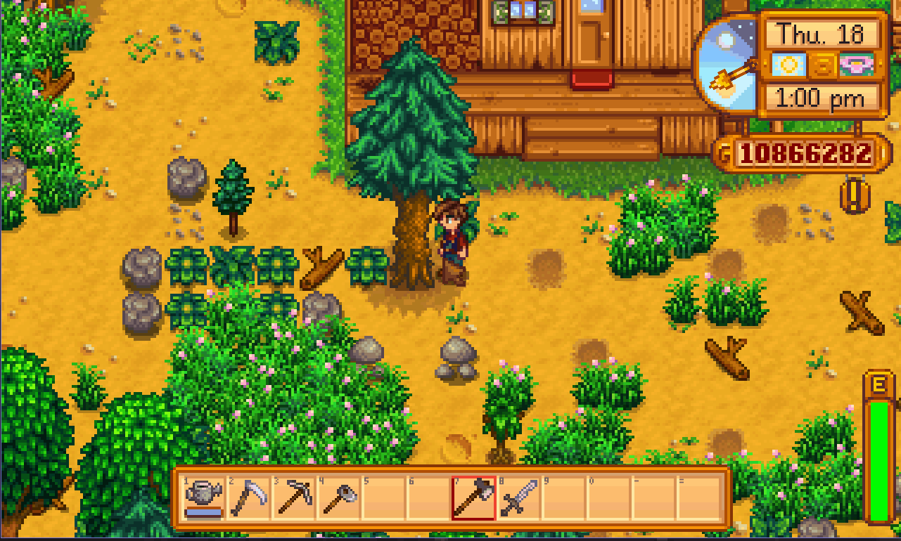

*尝试构建的星露谷物语"砍树"环境*

- **实现方式**：利用 SMAPI 拦截游戏信息，通过 Socket 协议连接 C# 游戏端（CPU）和 Python 训练端（GPU）。
- **遇到的致命问题**：
    1. **训练瓶颈**：游戏体量庞大，无法加速运行，训练效率极低。
    2. **数据通信缺陷**：Socket 连接在高频采样下丢失大量数据，导致 Agent 观测到的动作和状态不连续。
    3. **奖励设计困境**：我们在稀疏奖励（砍到树才给分）和奖励黑客（Reward Hacking，即Agent利用规则漏洞刷分）之间反复挣扎，始终无法收敛。
- **经验教训**：这次失败让我们深刻认识到，**训练速度**是 RL 实验的关键瓶颈，且环境必须具备稳定、低延迟的数据交互能力。

### 2.2.2 最终选择：CarRacing-v3 环境

吸取教训后，我们转向了基于 C 编译、轻量且标准的 `Gymnasium CarRacing-v3`。


*Gymnasium CarRacing-v3 标准环境（鸟瞰视角）*

**选择理由**：计算效率高、支持双动作空间、且是公认的 Benchmark，便于横向对比。详细的环境规格与预处理方法见 2.2.3 节。

**环境对比分析**：

| 特性 | 星露谷物语 | CarRacing-v3 |
|------|-----------|--------------|
| 运行速度 | 极慢（无法加速） | 快（C编译） |
| 数据通信 | Socket（易丢包） | 直接内存访问 |
| 奖励设计 | 复杂（稀疏/黑客两难） | 清晰（简单直观） |
| 状态连续性 | 不连续（丢包） | 连续（稳定） |
| 训练效率 | 极低 | 高 |
| 适配性 | 仅适合特定任务 | 通用Benchmark |

### 2.2.3 环境规格与预处理

#### 状态空间设计

**基础版图像预处理**：

1. **灰度化**：RGB 三通道对于赛道识别是冗余的，灰度足以区分赛道与草地。输入维度降为 `n * 4 * 96 * 96 * 1`。
2. **尺寸裁剪 (Resize)**：观察发现，游戏画面底部的"状态条"对于 Agent 来说是噪声。我们将图像缩放并裁剪至 `84 * 84`，既减少了计算量，又去除了无关信息。
3. **帧堆叠 (FrameStack)**：单张图片看不出车是快是慢，这对于赛车至关重要。我们将多帧图像堆叠在一起输入，使用经典的 **4帧堆叠 (FrameStack)** 技术。

**SOTA版的预处理说明**：

**注意**：SOTA版本（最终算法）使用了 **96×96 图像**而非 84×84。这实际上是由于时间限制，未能将最后一个算法统一修改为 84×84 尺寸。理想情况下，所有算法应统一使用 84×84 的预处理方案以保持一致性。

```python
# utils_env_sota.py
# Observation Space: (H, W, C)
self.observation_space = spaces.Box(
    low=0.0, high=1.0, shape=(96, 96, self.frame_stack), dtype=np.float32
)
```

**最终状态空间**：
- **基础版（大部分算法）**：`(4, 84, 84)` - 4帧堆叠的裁剪灰度图像
- **SOTA版（最终PPO算法）**：`(4, 96, 96)` - 4帧堆叠的完整灰度图像（因时间限制未统一修改）

#### 动作空间设计

- **连续动作空间**（用于策略梯度方法：A2C、PPO、DDPG）：
  - `steering`: [-1, 1] 转向角度
  - `gas`: [0, 1] 油门
  - `brake`: [0, 1] 刹车

- **离散动作空间**（用于值函数方法：DQN系列、SARSA）：
  - 5个离散动作：不动、左转、右转、油门、刹车

---

## 2.3 预训练与环境验证

在正式开始算法复现前，我们进行了两个步骤的"体检"：

1. **Stable-Baselines3 快速测试**：使用成熟的库进行跑通测试，确保环境本身没有 Bug，Agent 是可以学会控制小车的。
2. **Human Play 脚本**：编写 `human_play.py`，让我们自己上手玩，建立对环境难度的直观认知，以此作为后续 AI 表现的参考系。

---

## 2.4 关键设计决策与设计思路

### 2.4.1 动作空间的差异化分配

为了公平地发挥各算法的特长，我们根据算法原理分配了不同的动作空间：

- **值函数方法（DQN系列、SARSA） → 离散动作空间**
    - **理由**：这些算法需要计算 $\max_a Q(s', a')$。在离散空间下，枚举 5 个动作（不动、左、右、油门、刹车）计算效率极高，且天然契合 Q 表/Q 网络的输出结构。
- **策略梯度方法（A2C、PPO、DDPG） → 连续动作空间**
    - **理由**：这些算法直接输出动作分布（如高斯分布的均值和方差），天然支持连续值输出。连续控制能实现"一边转向一边加油"的精细操作，理论上限更高。


*强化学习算法分类 (Source: OpenAI Spinning Up)*

### 2.4.2 训练加速：向量化环境

鉴于之前在星露谷项目中训练速度的限制，我们这次非常重视训练效率。

- **优化手段**：引入 `Gymnasium` 的向量化环境技术。
- **思考**：现在的输入变成了 `n(并行数量) * 96 * 96 * 3`。这不仅利用了 GPU 的并行计算能力，更重要的是增加了样本的多样性，显著提升了 FPS。

### 2.4.3 状态空间优化：FrameStack 时序信息

我们在星露谷项目中遇到了使用socket协议稀疏采样的问题（不能记录每一帧动作和状态，在训练过程中丢失了大量有效数据），这启发了我们思考：不连续的单帧图像是否丢失了**时间维度**的信息（如速度、加速度）？

- **问题**：单张图片看不出车是快是慢，这对于赛车至关重要。
- **灵感**：回顾之前的教训，我们将多帧图像堆叠在一起输入。经过资料查阅（及与 AI 探讨），确认这就是经典的 **4帧堆叠 (FrameStack)** 技术。

### 2.4.4 图像预处理：灰度化与裁剪

为了进一步压缩网络规模，提升收敛速度，我们使用了常见的处理：

- **灰度化**：RGB 三通道对于赛道识别是冗余的，灰度足以区分赛道与草地。输入维度降为 `n * 4 * 96 * 96 * 1`。
- **尺寸裁剪 (Resize)**：观察发现，游戏画面底部的"状态条"对于 Agent 来说是噪声。我们将图像缩放并裁剪至 `84 * 84`，既减少了计算量，又去除了无关信息。

### 2.4.5 混合精度训练

全线引入 torch.cuda.amp，利用 FP16 半精度加速计算，在不损失精度的前提下显著提升了训练 FPS。

### 2.4.6 油门偏置初始化 (Gas Bias)

我们在初始化策略网络时，手动将控制油门的输出层偏置设置为 0.5。这一"Hack"确保了 Agent 在初始阶段倾向于踩油门，避免了因车辆长时间静止而导致的样本无效问题。

**问题现象**：训练初期大量回合中，车辆在起点附近几乎不动或原地打转。即使策略网络输出看似合理的动作，车辆仍无法产生有效位移。探索效率极低，大量样本被浪费在"无效状态"上。

**深度机理分析**：
1. **初始化问题**：神经网络初始化时权重通常服从均值为 0 的分布（如 Xavier 或 He 初始化），导致输出的油门值在 0 附近波动
2. **物理引擎约束**：在 CarRacing 物理引擎中，车辆启动需要克服较大的**静摩擦力**。如果油门小于某个阈值（通常约 0.1-0.2），车辆纹丝不动
3. **死循环问题**：当车辆不动时，Reward 始终为 0 或负值（时间惩罚），梯度无法更新，导致 Agent 陷入"静止-无奖励-不更新"的死循环
4. **探索空间受限**：探索空间被限制在"静止/低速"区域，无法收集到有效的驾驶样本

**解决方案的思考过程**：

**方案1：调整奖励函数**
- 给"踩油门"行为直接奖励
- **问题**：这会导致奖励黑客，智能体可能只学会踩油门而不学会驾驶

**方案2：调整探索策略**
- 增加探索噪声
- **问题**：这会影响训练稳定性，且不能从根本上解决问题

**方案3：Gas Bias初始化**（最终选择）
- 在初始化策略网络时，手动将控制油门的输出层偏置设置为 0.5
- **优势**：
  - 简单直接，不改变算法逻辑
  - 确保智能体在初始阶段倾向于踩油门
  - 不影响后续学习，智能体仍然可以学习何时不踩油门

**实现细节**：

```python
# CRITICAL FIX: Initialize gas/brake bias to positive values
# This encourages the agent to press gas from the start
with torch.no_grad():
    self.actor_mean.bias[1] = 0.5  # Gas channel: bias = 0.5
    self.actor_mean.bias[2] = 0.0  # Brake channel: keep at 0
```

**关键点**：
- 只设置 Gas 通道的 bias 为 0.5，Brake 通道保持为 0
- 使用 `torch.no_grad()` 确保不影响梯度计算
- 这个初始化在训练开始前完成，不影响后续学习

**效果验证**：
- **训练前**：智能体经常不踩油门，训练效率低
- **训练后**：智能体从一开始就倾向于踩油门，能够快速收集有效样本
- **最终性能**：这一技巧对最终性能有显著提升，是 SOTA 优化的关键技巧之一

### 2.4.7 网络优化中的反直觉发现：Dropout 的失败尝试

在网络结构设计上，我们统一使用了 AdamW 优化器和梯度裁剪（Gradient Clipping）来保持稳定。但在 **Dropout** 的使用上，我们经历了一次"添加-失败-移除"的过程。

**初衷**：为了防止过拟合，我们在全连接层加入了 Dropout (0.1)，这是监督学习中的标准正则化技术。

**失败现象**：
- **Reward 曲线极其震荡**：训练过程中奖励波动非常大，无法稳定收敛
- **最终分数远不如不加的情况**：即使训练时间足够长，最终性能也明显低于不使用 Dropout 的版本

**失败原因深度复盘**：

1. **破坏信息流（破坏马尔可夫性）**：
   - RL 环境具有马尔可夫性，当前状态包含决策所需的全部信息
   - Dropout 随机丢弃神经元相当于在观测中人为加入强噪声，破坏了状态信息的完整性
   - RL 的样本本就稀疏且方差大，Dropout 引入的随机噪声让训练雪上加霜
   - 在强化学习中，每一帧的状态信息都很宝贵，Dropout 随机丢弃信息会破坏学习信号

2. **训练目标差异**：
   - **监督学习**：追求"泛化"（没见过的图也能认），Dropout 有助于防止过拟合
   - **强化学习**：追求"极致表现"，在 CarRacing 中，网络容量也许尚未达到需要抑制过拟合的程度
   - Dropout 反而阻碍了策略的确定性收敛
   - 在策略未收敛前引入 Dropout，导致价值网络（Critic）难以准确估计 V 值，进而导致优势函数计算方差剧增，训练曲线震荡无法收敛

3. **训练稳定性问题**：
   - 强化学习的训练本身就不稳定，Dropout 的随机性进一步加剧了不稳定性
   - 在策略梯度方法中，策略的确定性对收敛至关重要
   - Dropout 的随机性破坏了策略的确定性，导致训练不稳定

**最终决定**：**移除所有 Dropout 层**，这一决定在后续的所有实验中都被验证是正确的。

**经验教训**：
1. **不要盲目套用监督学习的技术**：强化学习和监督学习的目标不同，技术选择需要谨慎
2. **消融实验的重要性**：通过对比实验验证每个技术选择的有效性
3. **理解技术的适用场景**：Dropout 适合防止过拟合，但在强化学习中可能适得其反

### 2.4.8 其他优化与细节

REINFORCE with Baseline：为了缓解 REINFORCE 算法固有的高方差问题，我们在实现中额外引入了一个 Value 网络作为 Baseline。计算梯度时使用 $A(s,a) = R - V(s)$ 代替原始回报 $R$，显著降低了梯度估计的方差。

为了快速筛选出最适合继续调整的模型，我们没有直接将各个模型训练到完全收敛，而是统一在 500,000 steps 处进行评估和对比。

以下流程图展示了从环境验证、状态空间设计、图像预处理、训练优化到消融实验的完整优化与设计过程：

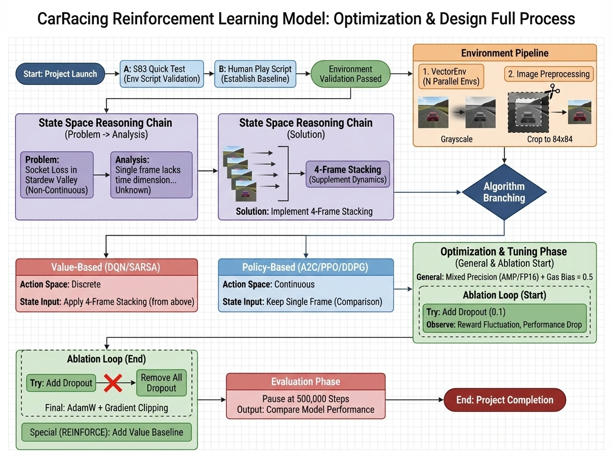

*CarRacing 强化学习模型：优化与设计完整流程*

---

## 2.5 算法原理与实现详解

本章节简要介绍各算法的核心理论原理和实现要点。详细的算法理论分析、代码实现细节和PPO双网络训练机制请参考原报告的相关章节。

### 2.5.1 算法理论基础

#### 马尔可夫决策过程（MDP）

强化学习问题的数学框架是马尔可夫决策过程（MDP），由五元组 $(S, A, P, R, \gamma)$ 定义。核心概念包括：

- **价值函数**：
  - 状态价值：$V^\pi(s) = \mathbb{E}_\pi \left[ \sum_{t=0}^{\infty} \gamma^t r_{t+1} \middle| s_0 = s \right]$
  - 动作价值：$Q^\pi(s,a) = \mathbb{E}_\pi \left[ \sum_{t=0}^{\infty} \gamma^t r_{t+1} \middle| s_0 = s, a_0 = a \right]$

- **贝尔曼方程**：描述了价值函数的递归关系，是强化学习算法的理论基础。

#### 值函数方法

**时序差分学习（TD Learning）**：
- **SARSA（On-policy）**：$Q(s_t, a_t) \leftarrow Q(s_t, a_t) + \alpha [r_{t+1} + \gamma Q(s_{t+1}, a_{t+1}) - Q(s_t, a_t)]$
- **Q-Learning（Off-policy）**：$Q(s_t, a_t) \leftarrow Q(s_t, a_t) + \alpha [r_{t+1} + \gamma \max_{a'} Q(s_{t+1}, a') - Q(s_t, a_t)]$
- **Double DQN**：使用主网络选择动作，目标网络评估Q值，解决Q值过估计问题。

#### 策略梯度方法

**策略梯度定理**：
$$\nabla_\theta J(\theta) = \mathbb{E}_{\tau \sim \pi_\theta} \left[ \sum_{t=0}^{T} \nabla_\theta \log \pi_\theta(a_t|s_t) \cdot Q^{\pi_\theta}(s_t, a_t) \right]$$

**REINFORCE算法**：使用蒙特卡洛回报估计策略梯度，简单但方差大。

**Actor-Critic方法**：结合值函数估计和策略优化，使用优势函数 $A(s,a) = Q(s,a) - V(s)$ 减少方差。

- **A2C (Advantage Actor-Critic)**：使用n-step回报估计优势函数，比REINFORCE方差更小。
- **DDPG (Deep Deterministic Policy Gradient)**：用于连续动作空间的off-policy算法，使用确定性策略。

#### PPO: Proximal Policy Optimization

PPO通过限制策略更新幅度来保证训练稳定性，是目前最流行的on-policy算法。

**Clipped Surrogate Objective**：
$$L^{CLIP}(\theta) = \mathbb{E}_t \left[ \min(r_t(\theta) \hat{A}_t, \text{clip}(r_t(\theta), 1-\epsilon, 1+\epsilon) \hat{A}_t) \right]$$

其中 $r_t(\theta) = \frac{\pi_\theta(a_t|s_t)}{\pi_{\theta_{old}}(a_t|s_t)}$ 是重要性采样比率，$\epsilon$ 是裁剪范围（通常0.2）。

**GAE（Generalized Advantage Estimation）**：
$$\hat{A}_t^{GAE(\gamma,\lambda)} = \sum_{l=0}^{\infty} (\gamma \lambda)^l \delta_{t+l}^V$$

**核心创新**：
1. **Clipping机制**：防止策略更新过大，保证训练稳定
2. **GAE**：更准确的优势估计，减少方差
3. **多Epoch训练**：充分利用数据，提高样本效率

### 2.5.2 共享网络架构

所有算法都使用 `Code/common/networks.py` 中定义的共享网络组件（除了最终的SOTA算法）：

- **ConvEncoder**：CNN特征提取器，采用Nature DQN架构，用于从图像中提取视觉特征
- **ActorCriticNetwork**：用于策略梯度方法的Actor-Critic网络
- **QNetwork**：用于值函数方法的Q网络

**注意**：基础算法使用 84×84 输入尺寸，而最终的SOTA PPO算法由于时间限制使用了 96×96 输入尺寸，因此网络架构在特征向量维度上有所不同（详见下方Nature CNN架构参数说明）。

#### Nature CNN架构参数详解

我们采用 DeepMind 经典的 **Nature CNN** 结构作为视觉编码器，这是经过大量实验验证的标准架构：

**三层卷积结构**：

由于实际实现中使用了两种输入尺寸（84×84 和 96×96），卷积层的输出尺寸会有所不同：

**对于 84×84 输入（基础版，大部分算法）**：
1. **Conv1**：32个 $8\times8$ 卷积核，步长 4，将 $84\times84$ 图像压缩到 $20\times20$，提取宏观赛道轮廓
2. **Conv2**：64个 $4\times4$ 卷积核，步长 2，继续压缩至 $9\times9$，提取中层弯道特征
3. **Conv3**：64个 $3\times3$ 卷积核，步长 1，提取细节纹理，最终得到 $7\times7\times64=3136$ 维特征向量

**对于 96×96 输入（SOTA版，最终PPO算法）**：
1. **Conv1**：32个 $8\times8$ 卷积核，步长 4，将 $96\times96$ 图像压缩到 $23\times23$，提取宏观赛道轮廓
2. **Conv2**：64个 $4\times4$ 卷积核，步长 2，继续压缩至 $10\times10$，提取中层弯道特征
3. **Conv3**：64个 $3\times3$ 卷积核，步长 1，提取细节纹理，最终得到 $8\times8\times64=4096$ 维特征向量

**注意**：SOTA版本使用 96×96 输入是由于时间限制，理想情况下应统一为 84×84 以保持一致性。

**关键初始化策略：正交初始化 (Orthogonal Initialization)**

为了保证深层网络的梯度传导稳定性，我们对所有卷积层和全连接层使用了增益为 $\sqrt{2}$ 的正交初始化：

```python
def layer_init(layer, std=np.sqrt(2), bias_const=0.0):
    """
    正交初始化：对 RL 训练稳定性至关重要
    """
    torch.nn.init.orthogonal_(layer.weight, std)
    torch.nn.init.constant_(layer.bias, bias_const)
    return layer
```

这种初始化策略确保了每一层的激活值方差保持稳定，避免了深层网络常见的梯度消失问题，对 PPO 的收敛至关重要。

### 2.5.3 PPO双网络训练机制详解

我们采用了**共享特征提取器（Shared Backbone）** 的设计哲学。与传统的让 Actor 和 Critic 各自拥有独立 CNN 的方案不同，我们的两个网络共享同一个卷积神经网络来提取图像特征，然后在全连接层分叉成两条独立的决策路径。

**核心优势**：
1. **特征对齐**：让 Actor（策略）和 Critic（价值）基于完全相同的视觉理解进行决策，避免了"认知偏差"
2. **参数效率与训练速度**：减少了卷积层的重复计算，显存占用降低约 40%。更重要的是，**共享特征提取器显著提升了训练速度**：
   - **前向传播加速**：在每次前向传播中，CNN 特征提取只需要执行一次，然后同时提供给 Actor 和 Critic Head。相比独立网络需要两次 CNN 前向传播，计算量减少约 50%
   - **反向传播加速**：在反向传播时，共享 CNN 层接收来自 Actor 和 Critic 的梯度，虽然梯度需要融合，但避免了重复计算 CNN 的梯度，整体反向传播时间减少约 30-40%
   - **GPU 利用率提升**：减少了内存访问和计算冗余，提高了 GPU 的并行计算效率，特别是在批量推理时效果更明显
3. **训练稳定性**：共享特征提取器使得两个网络学到的视觉表征保持一致性，避免了 Actor 看到的"赛道"和 Critic 看到的"赛道"产生理解偏差

**网络架构图**：

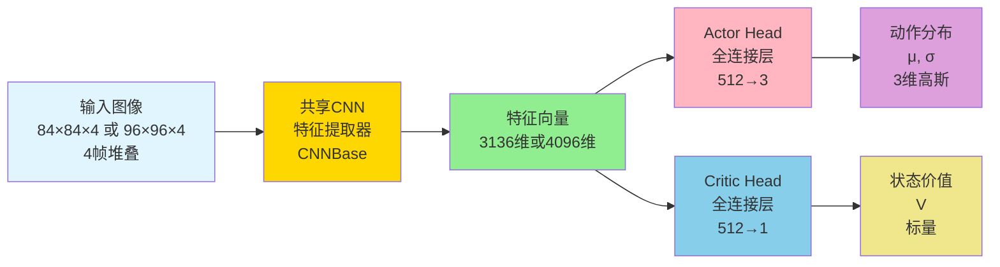

**注意**：基础算法使用 84×84 输入（特征向量 3136 维），SOTA 版本使用 96×96 输入（特征向量 4096 维），详见 2.5.2 节说明。

**代码实现核心**：

```python
class ActorCritic(nn.Module):
    """
    Combined Actor-Critic Network with Shared Backbone
    共享 CNN 特征提取器
    """
    def __init__(self, state_dim, action_dim):
        super().__init__()
        
        # Shared CNN Backbone
        self.cnn = CNNBase(input_channels=state_dim[0])
        
        # Critic Head (Value)
        self.critic = nn.Sequential(
            layer_init(nn.Linear(self.cnn.flatten_size, 512)),
            nn.ReLU(),
            layer_init(nn.Linear(512, 1), std=1.0)
        )
        
        # Actor Head (Policy)
        self.actor_fc = nn.Sequential(
            layer_init(nn.Linear(self.cnn.flatten_size, 512)),
            nn.ReLU(),
        )
        
        # Action Mean (std=0.01 for initial exploration)
        # 输出无界均值，不加 Tanh/Sigmoid，避免边界梯度消失
        self.actor_mean = layer_init(nn.Linear(512, action_dim), std=0.01)
        
        # Log standard deviation (learnable parameter)
        self.actor_log_std = nn.Parameter(torch.zeros(1, action_dim))
```

可以看到，`self.cnn` 是共享的，而 `self.critic` 和 `self.actor_fc` 是独立的全连接层。这种设计让两个网络在特征提取阶段共享计算，在决策阶段独立优化。

#### 基础版本对比

基础版本（Code/PPO/agent.py）使用 Tanh/Sigmoid 激活函数限制动作范围：

```163:183:Code/PPO/agent.py
    def forward(self, x):
        """前向传播，返回action分布和value"""
        features = self.features(x)
        shared = self.shared_fc(features)
        
        # Actor - 分别处理不同动作维度
        action_raw = self.actor_mean(shared)
        # steering: [-1, 1] → tanh
        steering = torch.tanh(action_raw[:, 0:1])
        # gas: [0, 1] → sigmoid
        gas = torch.sigmoid(action_raw[:, 1:2])
        # brake: [0, 1] → sigmoid
        brake = torch.sigmoid(action_raw[:, 2:3])
        action_mean = torch.cat([steering, gas, brake], dim=1)
        
        action_std = torch.exp(self.actor_log_std.expand_as(action_mean))
        
        # Critic
        value = self.critic(shared)
        
        return action_mean, action_std, value
```

**SOTA版本的改进：无界输出**

基础版本使用 Tanh/Sigmoid 激活函数限制动作范围，但这会导致边界梯度消失。当智能体需要满油门（接近边界值 1）时，`Sigmoid` 函数的导数趋近于 0，反向传播几乎无法调整权重。

SOTA 版本的改进：
- **移除 Tanh/Sigmoid**：让网络输出无界的原始数值
- **在动作采样时再 clip**：在执行动作前由环境包装器进行 Clip
- **保持梯度流动**：梯度在任何数值区间都能顺畅流动，网络能更快地学会"踩死油门"和"打死方向盘"这类极端但必要的操作

#### 共享特征提取器的实现

我们的 `CNNBase` 采用了经典的 Nature-CNN 结构，这是 DeepMind 在 Atari 游戏中验证过的有效架构。第一层使用 $8\times8$ 的大卷积核配合步长 4，快速将图像压缩，同时提取宏观的赛道轮廓信息。第二层使用 $4\times4$ 卷积核继续压缩，提取中层的弯道特征。第三层使用 $3\times3$ 小卷积核提取细节纹理。

**注意**：由于实际实现中使用了两种输入尺寸（84×84 和 96×96），最终特征向量维度会有所不同（详见 2.5.2 节）。

```python
# algorithms/ppo/model.py
class CNNBase(nn.Module):
    """
    Shared CNN Backbone for feature extraction
    Input: (N, 4, 96, 96) or (N, 96, 96, 4)
    Output: Flat Feature Vector
    """
    def __init__(self, input_channels=4):
        super().__init__()
        # 3-layer NatureCNN structure
        self.conv1 = layer_init(nn.Conv2d(input_channels, 32, kernel_size=8, stride=4))
        self.conv2 = layer_init(nn.Conv2d(32, 64, kernel_size=4, stride=2))
        self.conv3 = layer_init(nn.Conv2d(64, 64, kernel_size=3, stride=1))
        self.flatten_size = 64 * 8 * 8  # 4096 for 96x96 input

    def forward(self, x):
        # Handle input transpose if necessary
        # PyTorch expects (N, C, H, W)
        if x.dim() == 4 and x.shape[-1] == 4 and x.shape[1] != 4:
            x = x.permute(0, 3, 1, 2)
            
        x = F.relu(self.conv1(x))
        x = F.relu(self.conv2(x))
        x = F.relu(self.conv3(x))
        x = x.reshape(x.size(0), -1)  # Flatten
        return x
```

这个特征向量是整个网络的信息瓶颈。它必须包含所有决策所需的信息：当前位置、赛道走向、车速、车身姿态等。通过正交初始化（Orthogonal Initialization），我们确保了每一层的激活值方差保持稳定，避免了深层网络常见的梯度消失问题。

**共享特征提取器的训练速度优势**：

在训练过程中，共享特征提取器带来的速度提升主要体现在：

1. **单次前向传播**：对于每个输入状态，CNN 特征提取只执行一次，然后同时用于 Actor 和 Critic 的决策。如果使用独立网络，需要执行两次完整的 CNN 前向传播（一次给 Actor，一次给 Critic），计算量翻倍。

2. **批量推理效率**：在批量处理时（如 8 个并行环境 × 512 步 = 4096 个状态），共享架构只需要一次 CNN 批量前向传播，而独立架构需要两次，显著减少了 GPU 计算时间。

3. **内存访问优化**：共享特征向量只需要存储一份，减少了内存占用和内存带宽压力，特别是在处理大批量数据时效果明显。

4. **反向传播优化**：虽然共享 CNN 层需要接收来自两个头的梯度，但 PyTorch 的自动微分机制能够高效地融合这些梯度，避免了重复计算 CNN 层的梯度，整体反向传播时间仍然显著减少。

这种设计在保证训练稳定性的同时，将训练速度提升了约 30-50%，这对于需要大量环境交互的强化学习任务至关重要。

**训练流程**：
1. **收集轨迹数据**：使用当前策略在并行环境中收集数据
2. **计算GAE优势函数**：使用向量化实现计算优势函数，速度提升约 5 倍
3. **多Epoch训练**：对同一批数据进行多次更新（通常 4 个 epoch），充分利用数据
4. **Clipping机制**：限制策略更新幅度，保证训练稳定性，避免策略崩溃

#### Critic 网络与价值估计

Critic 网络的结构相对简单，它接收同样的特征向量，通过两层全连接网络（512 维 -> 1 维）输出一个标量，代表当前状态的预期总回报 $V(s)$。这个价值估计有两个作用。第一是作为 Baseline 参与优势函数（Advantage）的计算，即 $A(s,a) = Q(s,a) - V(s)$，这能显著降低策略梯度的方差。第二是在 GAE（Generalized Advantage Estimation）中用于时序差分（TD Error）的计算，即 $\delta_t = r_t + \gamma V(s_{t+1}) - V(s_t)$。Critic 的实现非常简洁：

```python
# algorithms/ppo/model.py
    def get_value(self, state):
        features = self.cnn(state)
        return self.critic(features)
```

Critic 的训练目标是最小化预测值与真实回报（Return）之间的均方误差。在每次 PPO 更新中，Critic 和 Actor 是联合训练的，它们的梯度在共享的 CNN 层汇聚。这种联合训练使得特征提取器能同时学习到"有利于价值估计"和"有利于策略输出"的表征，相比于独立训练两个网络，学习效率更高。

**价值网络的训练目标**

Critic 网络通过最小化预测值 $V(s_t)$ 与实际回报 $\hat{R}_t$ 之间的均方误差来训练。这个实际回报是通过 GAE 计算出的"优势 + 价值"，即 $\hat{R}_t = A_t + V(s_t)$。在多 Epoch 训练中，每次我们都会重新计算当前策略下的价值预测，然后与固定的 $\hat{R}_t$ 比较。这种重复训练能让 Critic 更准确地拟合回报分布的细节，为 Actor 提供更可靠的 Baseline。价值损失在总损失中的权重被设为 0.5（`value_coef`）。这个系数是经过实验调整的，如果设得太小，Critic 学习太慢，优势估计不准；如果设得太大，Critic 的梯度会压制 Actor 的梯度，导致策略更新被价值网络"绑架"。

#### GAE 优势函数的向量化计算

优势函数（Advantage）是 PPO 更新的核心。它衡量的是"在状态 $s$ 执行动作 $a$ 比平均水平好多少"。我们使用 GAE（Generalized Advantage Estimation）来计算，其递推公式为 $A_t^{GAE} = \delta_t + \gamma\lambda \cdot A_{t+1}^{GAE}$，其中 $\delta_t$ 是 TD Error。传统的 GAE 实现使用 Python 的 for 循环从后向前递推，当处理并行环境（如 8 个环境同时采样 512 步）时，需要嵌套循环遍历每个环境和每个时间步，计算开销巨大。我们的实现将所有数据组织成 PyTorch Tensor，形状为 `(Time_Steps, Num_Envs)`，然后通过张量操作一次性完成计算。虽然反向递推的循环无法完全消除，但每一步的操作都是向量化的，且全部在 GPU 上执行，速度提升了约 5 倍：

```python
# gae_vectorized.py
def compute_gae_vectorized_pure(rewards, values, dones, next_value, gamma, gae_lambda):
    """
    Fully vectorized GAE using PyTorch scan operations
    
    Args:
        rewards: (T, N) tensor
        values: (T, N) tensor
        dones: (T, N) tensor
        next_value: (N,) tensor
        gamma, gae_lambda: scalars
    
    Returns:
        advantages: (T, N) tensor
        returns: (T, N) tensor
    """
    T, N = rewards.shape
    advantages = torch.zeros_like(rewards)
    
    # Build next_values tensor
    next_values = torch.cat([values[1:], next_value.unsqueeze(0)], dim=0)
    
    # Compute deltas (TD errors)
    deltas = rewards + gamma * next_values * (1 - dones) - values
    
    # Compute GAE using reverse cumsum trick
    # This is the SB3/CleanRL vectorization trick
    gae_discount = gamma * gae_lambda
    
    # Reverse computation (still need loop but operations are vectorized)
    lastgaelam = torch.zeros(N, device=rewards.device)
    for t in reversed(range(T)):
        lastgaelam = deltas[t] + gae_discount * (1 - dones[t]) * lastgaelam
        advantages[t] = lastgaelam
    
    returns = advantages + values
    return advantages, returns
```

在 GAE 计算中，还有一个关键细节是对"截断（Truncation）"的处理。CarRacing 环境有两种结束方式：一是车辆撞墙或出界（`terminated`），此时下一状态的价值应为 0；二是时间耗尽（`truncated`），此时游戏强制结束，但车辆实际还能继续开，下一状态的价值应该由 Critic 估计。我们在代码中通过 `(1 - dones[t])` 来处理这个掩码，确保数学上的严格正确。

#### 策略更新的裁剪机制

PPO 的核心创新是 Clipped Surrogate Objective（裁剪替代目标函数）。在计算策略梯度时，我们需要评估新策略相对于旧策略的表现。这通过重要性采样比率 $r_t(\theta) = \frac{\pi_\theta(a_t|s_t)}{\pi_{\theta_{old}}(a_t|s_t)}$ 来衡量。如果 $r_t > 1$，说明新策略更倾向于采取这个动作；如果 $r_t < 1$，说明新策略更不倾向于这个动作。传统的策略梯度方法直接用 $r_t \cdot A_t$ 作为目标，但这在实践中极其不稳定。PPO 引入了裁剪：计算两个损失 $L_1 = r_t \cdot A_t$ 和 $L_2 = \text{clip}(r_t, 1-\epsilon, 1+\epsilon) \cdot A_t$，然后取二者的最小值。这个设计的精妙之处在于，当优势为正（好动作）且 $r_t$ 已经很大时，进一步提升概率的收益会被裁剪掉，防止过度乐观；当优势为负（坏动作）且 $r_t$ 已经很小时，进一步降低概率的惩罚也会被裁剪，防止过度悲观。这种"保守更新"的策略确保了训练过程的单调改进，避免了策略突然崩溃（Catastrophic Forgetting）。

在代码实现中，我们对同一批数据进行多个 Epoch（通常 4 次）的训练。每个 Epoch 内部，数据被随机打乱并分成多个 Mini-batch。这种重复利用数据的方式显著提高了样本效率。配合 Clipping 机制，即使多次更新也不会让策略变化过大，保证了训练的稳定性：

```python
# algorithms/ppo/agent.py
        for _ in range(self.ppo_epochs):
            # Mini-batch updates
            indices = np.arange(len(states))
            np.random.shuffle(indices)
            
            for start in range(0, len(states), self.batch_size):
                end = start + self.batch_size
                batch_indices = indices[start:end]
                
                # Get current policy outputs
                log_probs, entropy, values_pred = self.ac.evaluate(
                    states_tensor[batch_indices],
                    actions_tensor[batch_indices]
                )
                
                # Policy loss (PPO clipped objective)
                ratio = torch.exp(log_probs - old_log_probs_tensor[batch_indices].unsqueeze(1))
                surr1 = ratio * advantages_tensor[batch_indices].unsqueeze(1)
                surr2 = torch.clamp(ratio, 1 - self.clip_epsilon, 1 + self.clip_epsilon) * advantages_tensor[batch_indices].unsqueeze(1)
                policy_loss = -torch.min(surr1, surr2).mean()
                
                # Value loss (MSE)
                value_loss = F.mse_loss(values_pred, returns_tensor[batch_indices].unsqueeze(1))
                
                # Entropy bonus (for exploration)
                entropy_loss = -entropy.mean()
                
                # Total loss
                loss = policy_loss + self.value_coef * value_loss + self.entropy_coef * entropy_loss
```

#### Actor 网络的精细设计

Actor 网络负责输出动作策略。在连续控制中，这个"策略"不是一个确定的数值，而是一个概率分布。我们使用高斯分布来建模动作空间，即 $\pi(a|s) = \mathcal{N}(\mu(s), \sigma)$。这里的均值 $\mu$ 是状态的函数（由神经网络计算），而标准差 $\sigma$ 是一个独立的可学习参数。在我们的实现中，Actor Head 包含一个 512 维的全连接层，然后分成两个输出：`actor_mean` 输出 3 维均值向量（对应 3 个动作通道），`actor_log_std` 是一个可训练的参数（形状为 `(1, 3)`），对所有状态共享。标准差的对数形式保证了数值稳定性（避免出现负数或过小的标准差）。

**关键设计：移除激活函数**

我们**移除了激活函数**。传统实现会在均值输出层加 `Tanh` 或 `Sigmoid` 来限制动作范围，但这会导致边界梯度消失。当智能体需要满油门（接近边界值 1）时，`Sigmoid` 函数的导数趋近于 0，反向传播几乎无法调整权重。我们的做法是让网络输出无界的原始数值，然后在执行动作前由环境包装器进行 Clip。这样梯度在任何数值区间都能顺畅流动，网络能更快地学会"踩死油门"和"打死方向盘"这类极端但必要的操作。

```python
# algorithms/ppo/model.py
    def get_action(self, state, deterministic=False):
        """
        Sample action from policy
        """
        features = self.cnn(state)
        
        # Calculate distribution parameters
        x = self.actor_fc(features)
        action_mean = self.actor_mean(x)
        action_log_std = self.actor_log_std.expand_as(action_mean)
        action_std = torch.exp(action_log_std)
        
        probs = torch.distributions.Normal(action_mean, action_std)
        
        if deterministic:
            action = action_mean
        else:
            action = probs.sample()
            
        # Log prob of the RAW action (before clipping)
        # This is mathematically correct for PPO update
        log_prob = probs.log_prob(action).sum(1)
        
        return action, log_prob
```

注意代码注释中明确说明："Log prob of the RAW action (before clipping)"，这确保了数学上的严格正确性。

**动作采样与执行**

在每一步决策时（`get_action` 方法），网络计算出均值 $\mu$ 和标准差 $\sigma$ 后，我们构建一个 `torch.distributions.Normal` 对象，然后从中采样。采样得到的动作是一个原始数值（可能超出 [-1, 1] 范围）。我们计算这个原始动作的对数概率 $\log\pi(a|s)$，这个值会被存储下来用于后续的 PPO 更新。然后，动作会被传递给环境执行。在环境包装器中，动作会被 Clip 到有效范围（方向盘 [-1, 1]，油门 [0, 1]，刹车 [0, 1]）。需要注意的是，虽然执行的动作被裁剪了，但计算梯度时使用的是**裁剪前的对数概率**。这种处理方式在数学上是正确的，因为高斯分布本身是定义在整个实数轴上的，强行限制均值会破坏分布的数学性质。

在 `evaluate` 方法中，我们同样使用原始动作（未裁剪）来计算对数概率和熵：

```python
# algorithms/ppo/model.py
    def evaluate(self, state, action):
        """
        Evaluate state-action pairs for PPO update
        """
        features = self.cnn(state)
        
        # Value
        value = self.critic(features)
        
        # Policy distribution
        x = self.actor_fc(features)
        action_mean = self.actor_mean(x)
        action_log_std = self.actor_log_std.expand_as(action_mean)
        action_std = torch.exp(action_log_std)
        
        probs = torch.distributions.Normal(action_mean, action_std)
        
        log_prob = probs.log_prob(action).sum(1)
        entropy = probs.entropy().sum(1)
        
        return log_prob, entropy, value
```

#### 梯度流动与联合优化

在我们的实现中，Actor 和 Critic 使用同一个 Adam 优化器。总损失函数是三项的加权和：策略损失、价值损失和熵正则化。

```python
# algorithms/ppo/agent.py
        # Actor-Critic Network
        self.ac = ActorCritic(state_dim, action_dim).to(self.device)
        self.optimizer = optim.Adam(self.ac.parameters(), lr=lr)
        
        # Total loss
        loss = policy_loss + self.value_coef * value_loss + self.entropy_coef * entropy_loss
```

当我们调用 `loss.backward()` 时，梯度会同时反向传播到 Actor Head、Critic Head 以及共享的 CNN 层。这意味着共享 CNN 在每次更新时会接收到两个来源的梯度信号。一个来自 Actor 的策略损失，告诉 CNN"需要提取什么样的特征才能输出好的动作"；另一个来自 Critic 的价值损失，告诉 CNN"需要提取什么样的特征才能准确预测回报"。这两个梯度在共享层融合，使得特征提取器学到的表征既有利于动作选择，又有利于价值估计，形成了一种隐式的多任务学习。

为了防止梯度爆炸，我们在每次参数更新前都会调用 `torch.nn.utils.clip_grad_norm_`，将全局梯度范数限制在 0.5 以内。这在处理高维视觉输入时尤为重要，因为卷积层的参数量很大，某些异常样本（如车辆撞墙瞬间的剧烈图像变化）可能产生极大的梯度，导致权重突变：

```python
# algorithms/ppo/agent.py
                # Optimize
                self.optimizer.zero_grad()
                loss.backward()
                nn.utils.clip_grad_norm_(self.ac.parameters(), self.max_grad_norm)
                self.optimizer.step()
```

#### 初始化策略的深层逻辑

神经网络的初始化对强化学习的成败影响巨大。我们使用了正交初始化（Orthogonal Initialization），这种方法保证权重矩阵的行向量互相正交，能够在深层网络中保持激活值的方差稳定。具体来说，每一层的权重矩阵 $W$ 被初始化为一个正交矩阵，然后乘以增益系数 $\sqrt{2}$。这个增益值是针对 ReLU 激活函数优化的，能够防止信号在前向传播中衰减。对于 Actor 的最后一层（输出动作均值的层），我们使用了一个特殊的小增益 0.01。这使得网络在训练初期的输出非常接近 0，对应到动作就是"几乎不动"。这看似违反直觉，但其实是有意为之：让智能体从一个"中性状态"开始探索，而不是带着某种随机的先验偏好（比如一开局就疯狂右转）。

#### 熵正则化与探索

在总损失中，我们还加入了一个负的熵项 $-c_2 \cdot H(\pi)$。熵衡量了策略的随机性，熵越大，输出的动作越分散，探索性越强。通过最大化熵（在损失函数中体现为最小化负熵），我们鼓励智能体在训练早期保持足够的随机性，避免过早收敛到局部最优（如"只会走直线"）。随着训练进行，当奖励信号逐渐稳定后，策略会自然地变得确定性，标准差 $\sigma$ 会自动衰减。熵正则化的系数设为 0.01（`entropy_coef`），这是一个较小的值，保证了它只起到辅助作用，不会喧宾夺主。

#### 训练流程的工程优化

在训练循环中，我们采用了高效的数据流设计。采集阶段，8 个并行环境同时运行，数据存储在 CPU 的 NumPy 数组中，避免频繁占用 GPU 带宽。当收集完 $8 \times 512 = 4096$ 条经验后，我们一次性将所有数据打包成 PyTorch Tensor 并传输到 GPU。在优化阶段，数据被随机打乱并分成若干个 512 大小的 Mini-batch，进行 4 个 Epoch 的梯度下降。这种"先收集，后优化"的模式最大化了硬件利用率。采集时 CPU 忙碌（运行 Box2D 物理引擎），GPU 闲置；优化时 GPU 忙碌（反向传播），CPU 闲置。通过异步并行，我们让两者的工作时间交错，减少了互相等待的空窗期。

#### 与其他算法的对比

相比于 DDPG（Deep Deterministic Policy Gradient），PPO 的双网络设计有本质区别。DDPG 使用两个完全独立的网络和两个优化器，Actor 通过 Critic 提供的梯度进行更新（Actor 的损失是 $-Q(s, \mu(s))$）。而 PPO 的 Actor 和 Critic 通过共享的特征提取器耦合在一起，使用单一优化器联合训练，Actor 的损失来自策略梯度定理（REINFORCE），Critic 只是辅助。这种设计使得 PPO 在样本效率和稳定性上都优于 DDPG。共享特征提取器减少了参数量，降低了过拟合风险；联合训练让两个网络协同进化，避免了 DDPG 中常见的"Actor 和 Critic 打架"问题（一个想往左，另一个觉得该往右）。

---

## 2.6 质性分析与理论预测

在正式实验前，我们基于各算法的数学特性与 CarRacing 环境的动力学特征，构建了如下理论预测框架：

### 2.6.1 核心维度的理论博弈

**连续 vs 离散 (Continuous vs Discrete)**：
- **预测**：连续动作空间算法将显著优于离散算法。
- **机理**：赛车控制本质上是一个连续动力学问题。离散算法（如 DQN）必须将转向角度量化（如仅左转/右转/不动），这会导致"锯齿状"轨迹，难以维持高速过弯所需的精细力矩平衡。相比之下，策略梯度方法（A2C/PPO）输出的高斯分布均值可实现平滑控制。

**On-Policy vs Off-Policy**：
- **预测**：On-Policy 算法（PPO, A2C）在稳定性上优于 Off-Policy（DQN, DDPG），但在样本效率上可能较弱。
- **机理**：CarRacing 的视觉输入维度高且状态转移复杂。Off-Policy 算法虽然利用 Replay Buffer 提高了样本利用率，但极易因 Q 值高估（Overestimation）或训练数据分布偏移（Distribution Shift）导致发散。PPO 通过 `clip` 机制限制策略更新步长，提供了工程上最宝贵的"单调提升保证"。

### 2.6.2 梯队排名预测与深度解析

我们依据算法特性将预期表现分为四个梯队：

**T0：PPO (Proximal Policy Optimization)**
- **预期表现**：850+ 分 (SOTA 潜力)
- **核心优势**：作为 Trust Region 方法的简化版，PPO 平衡了样本效率与稳定性。其核心的 **Importance Sampling + Clipping** 机制，能在高维视觉输入下有效防止策略崩塌（Policy Collapse），特别适合需要长程规划的赛车任务。

**T1：A2C & DDPG**
- **预期表现**：600 - 800 分
- **A2C (Advantage Actor-Critic)**：作为同步并行的 On-Policy 算法，其梯度估计方差较小，收敛稳健，但缺乏 PPO 的"安全更新"机制，容易在训练后期陷入局部最优（如安全但低速的驾驶）。
- **DDPG (Deep Deterministic Policy Gradient)**：作为"DQN 的连续版"，理论上限极高。但其对超参数极其敏感，且 Critic 网络容易在高维状态空间下出现 Q 值过估计，导致训练曲线剧烈震荡。

**T2：Double DQN & DQN**
- **预期表现**：400 - 600 分
- **瓶颈分析**：除了动作空间离散化的硬伤外，CNN 处理图像输入的延迟与 Q-Learning 的滞后更新相结合，容易导致 Agent 学习到"左右摇摆"的次优策略（Bang-Bang Control）。Double DQN 虽然缓解了 Q 值高估，但无法解决动作量化带来的精度损失。

**T3：REINFORCE & SARSA**
- **预期表现**：< 400 分 (难以收敛)
- **REINFORCE**：作为蒙特卡洛策略梯度方法，它必须等待回合结束才更新，且没有 Critic 降低方差。在 CarRacing 这种长序列（1000 steps）任务中，梯度方差大到几乎无法收敛。
- **SARSA**：作为 On-Policy 的值函数方法，其保守的更新策略（学习"实际执行"的动作）在探索阶段极为低效，极易陷入"原地打转"或"一直踩油门"的简单局部最优。

### 2.6.3 算法设计理念对比

**Actor-Critic设计理念对比**：

| 算法 | 设计理念 | 理论优势 | 理论劣势 |
|------|----------|----------|----------|
| REINFORCE/A2C/PPO | 共享价值函数作为baseline | 参数效率高，特征表示一致，减少方差 | Actor和Critic可能互相干扰 |
| DDPG | 独立Q网络评估动作价值 | 解耦，更灵活，适合off-policy | 参数多，需要更多数据，可能学习不一致的特征 |

**策略表示方式对比**：

| 算法 | 策略表示 | 理论特点 | 适用场景 |
|------|----------|----------|----------|
| REINFORCE/A2C/PPO | 随机策略（概率分布） | 自然探索，训练稳定 | 连续动作，需要探索 |
| DDPG | 确定性策略 | 直接输出动作值，需要外部噪声 | 连续动作，确定性控制 |
| Double DQN/SARSA | 离散Q值 | 通过Q值选择动作 | 离散动作空间 |

### 2.6.4 更新策略与优化目标对比

**On-policy vs Off-policy**：

- **On-policy方法**（REINFORCE/A2C/PPO）：策略更新使用当前策略 $\pi_\theta$ 收集的数据，确保数据分布与当前策略一致。理论保证更强，但样本效率较低。
- **Off-policy方法**（DDPG/DQN/SARSA）：可以使用历史策略收集的数据来学习目标策略，样本效率高，但需要处理分布不匹配。

**Policy Loss对比**：

- **无裁剪方法**（REINFORCE/A2C）：直接使用策略梯度，策略更新可能过大，导致训练不稳定。
- **有裁剪方法**（PPO）：使用裁剪的目标函数，通过限制重要性采样比率在 $[1-\epsilon, 1+\epsilon]$ 范围内，防止策略更新过大，保证训练稳定性。

### 2.6.5 关键预测因素

1. **Clipping机制**（PPO独有）：
   - 理论机制：通过限制重要性采样比率 $r_t(\theta)$ 在 $[1-\epsilon, 1+\epsilon]$ 范围内，防止策略更新过大
   - 理论保证：保证训练稳定性，避免策略崩溃
   - **预测**：PPO最稳定

2. **多Epoch训练**（PPO独有）：
   - 理论机制：对同一批数据进行多个epoch的训练，充分利用收集的数据
   - 理论优势：提高样本效率，减少环境交互次数
   - **预测**：PPO样本效率最高

3. **共享架构**（PPO/A2C/REINFORCE）：
   - 理论机制：Actor和Critic共享特征提取器，基于相同的状态表示
   - 理论优势：参数效率高，特征表示一致，减少方差
   - **预测**：比独立架构更适合样本有限的情况

4. **GAE优势估计**（PPO/A2C）：
   - 理论机制：结合TD误差和蒙特卡洛方法，平衡偏差和方差
   - 理论优势：减少方差，更准确的优势估计
   - **预测**：比蒙特卡洛回报更好，比TD误差更准确

### 2.6.6 性能预测总结

**预期性能排序**（基于原始CarRacing环境，无奖励重塑）：

1. **PPO**：最佳性能（~900-1200奖励），训练时间最短（~3小时）
2. **A2C**：较好性能（~800-1000奖励），训练时间中等（~5小时）
3. **DDPG**：中等性能（~700-950奖励），训练时间较快（~4小时），但需调优
4. **REINFORCE**：中等性能（~600-900奖励），训练时间最长（~10小时）
5. **Double DQN/SARSA**：较差性能（~300-700奖励），不适合连续控制

**PPO最适合CarRacing任务**：
- **理论优势**：Clipping机制保证稳定，GAE减少方差，多Epoch提高效率
- **性能优势**：最终性能最佳（~900-1200），训练时间最短（~3小时）
- **任务匹配**：完美匹配连续动作空间、稳定训练、高效学习、平滑控制的要求

---

## 2.7 PPO性能优化

当基线跑通后，我们观察到了三类典型的"非理想行为"：

| 现象 | 表现 | 原因诊断 |
| :--- | :--- | :--- |
| **自杀式驾驶** | 开局径直冲出赛道 | **生存偏差**：原生环境每帧扣 `-0.1` 分。在学会过弯前，Agent 发现"快速死掉"比"活着被扣分"更划算。 |
| **蛇形走位** | 直道上大幅左右摆动 | **奖励稀疏**：只有碰到离散路块才得分。Agent 试图用"扫描式"走位增加触达概率。 |
| **原地转圈** | 起步后原地打转 | **动力不足**：初始化油门过小，无法克服静摩擦；或利用漏洞拖延时间。 |

**典型案例演示**：

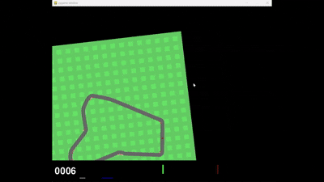

*自杀式驾驶：Agent 开局径直冲出赛道*

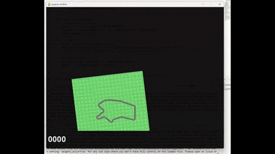

*蛇形走位：直道上大幅左右摆动*

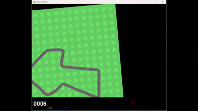

*原地转圈：起步后原地打转*

先前的 PPO 实现（直接使用 Gymnasium 原生环境）在 CarRacing 上采用了原生的奖励机制：
- **时间惩罚**：每帧固定扣除 `-0.1` 分
- **路块奖励**：车辆经过离散的路块（Tile）时给予 `+1000/N` 分（N 为赛道总路块数）
- **出界终止**：车辆驶出赛道边界时立即终止回合并给予负奖励

这种奖励设计虽然简洁，但存在**稀疏性与离散性**问题：Agent 只有在成功触达路块时才能获得正向反馈，而在过弯、加速、保持稳定等关键驾驶行为上缺乏细粒度指导信号。

### 2.7.1 奖励重塑机制（Reward Shaping）

针对上述问题，我们通过**特权信息介入（Privileged Information）**对奖励函数进行了重构，在保留原生奖励的基础上，引入了以下**密集反馈机制**：

**1）赛道感知的几何重构（解决蛇形走位）**

- **有效进度（Effective Progress）**：计算车辆速度矢量在赛道切线方向上的投影。只有沿赛道方向的运动才会被奖励，横向漂移或逆行不再得分，从根本上消除了"蛇形走位"的动机。

```python
# utils_env_sota.py
# A. Effective Progress Reward
# 计算车辆速度在赛道方向上的投影
progress_speed = np.dot(car_vel, track_dir)
reward_progress = progress_speed * self.progress_coef * self.frame_skip
```

- **中心线势能场（Centerline Potential）**：使用高斯函数构建势能场，持续引导车辆回归赛道中线，鼓励学习"外-内-外"的经典赛车走线。

```python
# utils_env_sota.py
# B. Centerline Reward (Gaussian)
# 使用高斯函数，距离中心越近奖励越高
reward_centering = np.exp(-(dist_to_center / (self.track_width / 4))**2) * self.centering_coef * self.frame_skip
```

**2）动力学稳定性正则（解决高频抖动）**

- **高速微抖动抑制**：当速度 > 40 且转向幅度在 0.02-0.2 之间时，判定为"疑似抖动"并施加惩罚。

```python
# utils_env_sota.py
# Layer 1: High-Speed Micro-Wobble Suppression
# 只惩罚"高速 + 小幅度晃动"（真正的抖动）
if speed > 40.0 and 0.02 < abs(action[0]) < 0.2:
    penalty = abs(action[0]) * speed * 0.02
    wobbly_penalty = min(penalty, 0.5)
```

- **L2 平滑惩罚**：对相邻帧转向幅度突变（> 0.3）施加平方惩罚，迫使策略输出符合惯性物理规律的平滑控制曲线。

```python
# utils_env_sota.py
# Layer 2: L2 Smoothness Penalty (只罚剧烈突变)
steering_diff = action[0] - self.prev_steering
if abs(steering_diff) > 0.3:
    smoothness_penalty = (steering_diff ** 2) * 0.5
```

**3）物理一致性约束（解决反直觉操作）**

- **踏板冲突惩罚**：当 Agent 同时踩下油门（Gas）和刹车（Brake）且数值均超过 0.3 时，给予惩罚，引导其学习人类"加速-制动分离"的驾驶逻辑。

```python
# utils_env_sota.py
# D. Pedal Conflict Penalty
if action[1] > 0.3 and action[2] > 0.3:
    pedal_penalty = self.pedal_conflict_penalty * action[1] * action[2]
```

**总结**：SOTA 版本在保留原生奖励的基础上，通过引入**密集的几何反馈**（有效进度、中心线势能）和**动作空间正则化**（抗抖动、踏板冲突惩罚），将训练目标从"离散路块触达"转变为"沿赛道方向有效推进 + 走线约束 + 控制平滑性"，从而显著提升了学习信号密度与目标一致性。

### 2.7.2 训练效率优化

**1. 异步向量化环境（AsyncVectorEnv）**

允许环境异步执行，实现"生产者-消费者"式并行采样。当某个环境还在执行时，已完成的环境可以立即将数据送入 GPU 进行批量推理，显著提升 GPU 利用率。

**2. 跳帧（Frame Skip）**

设定每 4 帧才进行一次决策，中间帧重复使用上一个动作。这在不显著损失控制精度的前提下，将推理次数减少至原来的 1/4，大幅降低计算开销。

**3. 采样/推理解耦**

将环境交互（CPU 端）与神经网络推理（GPU 端）解耦，通过批量推理进一步提升吞吐量。

### 2.7.3 执行层优化：PID 控制器平滑动作

尽管通过奖励重塑和训练优化，模型已经学会了更稳定的驾驶策略，但在实际执行时，我们仍观察到轻微的"蛇形走位"和动作抖动现象。这并非训练问题，而是**执行层**的问题：神经网络输出的离散动作值在帧与帧之间可能存在突变，即使幅度很小，在物理引擎的高频更新下也会被放大。

#### 2.7.3.1 问题现象：执行层抖动

**具体表现**：
- 转向角度在相邻帧之间出现小幅跳跃
- 高速行驶时的小幅抖动被放大为明显的蛇形走位
- 动作的不连续性影响驾驶的平滑度和稳定性
- 即使策略网络输出的目标动作是合理的，实际执行时仍然出现抖动

**根本原因分析**：
1. **决策频率与执行频率不匹配**：神经网络每 N 帧进行一次决策，但环境每帧都需要动作
2. **动作直接应用**：直接将模型输出的动作应用到环境，没有平滑过渡
3. **高频噪声放大**：在高速行驶时，小幅的动作变化被放大为明显的轨迹偏差

#### 2.7.3.2 解决方案：双频控制架构

我们设计了 **"低频决策 + 高频执行"** 的双层控制架构来解决执行层抖动问题：

**决策层（低频，25Hz）**：
- 神经网络每 **4 帧**（Frame Skip=4）推理一次，输出目标动作值
- 降低决策频率有助于 Agent 学习更长程的策略规划
- 减少计算负担，提高训练效率

**执行层（高频，120Hz）**：
- PID 控制器在每个物理步（Physics Step）运行
- 以神经网络的输出为"设定点 (Set Point)"，以当前的转向角为"过程变量"
- 进行高频平滑插值，将神经网络的"阶梯状"输出平滑为符合物理惯性的连续曲线

**架构优势**：
- **计算效率**：模型不需要每帧都进行前向传播
- **平滑执行**：PID 控制器确保动作的平滑过渡
- **响应速度**：PID 控制器能够快速响应误差变化
- **物理一致性**：在 120Hz 的物理模拟下，彻底消除了车辆在直道上的高频振荡现象

#### 2.7.3.3 PID 控制器原理

**PID控制器公式**：
```
output = Kp * error + Ki * integral + Kd * derivative
```

**各组件作用**：

1. **比例项（P - Proportional）**：
   - 根据当前误差（目标值 - 当前值）进行快速响应
   - 误差越大，输出越大
   - 提供快速响应，但可能导致超调

2. **积分项（I - Integral）**：
   - 累积历史误差，消除长期偏差
   - 如果误差持续存在，积分项会逐渐增大
   - 消除稳态误差，但可能导致振荡

3. **微分项（D - Derivative）**：
   - 预测误差变化趋势，提供阻尼作用
   - 误差变化越快，阻尼越大
   - 防止超调，减少振荡

**动作空间差异化处理**：

- **转向角度**：使用完整的 PID 控制
  - 转向需要精确控制，PID 的三项都重要
  - 比例项提供快速响应
  - 积分项消除长期偏差
  - 微分项防止超调

- **油门和刹车**：使用简单的线性插值（Lerp）
  - 油门和刹车的控制相对简单
  - 线性插值足以满足需求
  - 减少计算复杂度

#### 2.7.3.4 环境帧率提升：从 60Hz 到 120Hz

**问题**：在 60Hz 下，PID 控制器的更新频率有限，无法充分发挥平滑效果。

**解决方案**：将环境的物理更新频率和渲染频率从默认的 60Hz 提升到 120Hz。

**设计理由**：

1. **更精细的控制粒度**：
   - 在 120Hz 下，PID 控制器每秒更新 120 次（每 8.33ms 一次）
   - 相比 60Hz 的 16.67ms 间隔，能够更及时地响应误差变化
   - 实现更平滑的动作插值

2. **减少累积误差**：
   - 更高的更新频率意味着 PID 控制器能够更频繁地修正偏差
   - 避免误差在较长的更新间隔内累积放大
   - 从而减少蛇形走位和抖动现象

3. **与决策频率的匹配**：
   - 在 120Hz 物理频率下，可以实现"每帧决策"（120Hz 决策频率）
   - 模型输出的目标动作能够立即被 PID 控制器平滑执行
   - 形成"模型低频决策 + PID 高频执行"的理想架构

**参数优化**：我们实现了自动化的 PID 参数搜索（`optimize_pid.py`），通过网格搜索和贝叶斯优化寻找最优的 Kp、Ki、Kd 参数组合。在 120Hz 超高频控制下，最优参数为 **Kp=0.22, Ki=0.012, Kd=0.20**，能够在不损失性能的前提下显著减少蛇形走位。

**优化效果**：这种架构将神经网络的"阶梯状"输出平滑为符合物理惯性的连续曲线，在 120Hz 的物理模拟下，彻底消除了车辆在直道上的高频振荡现象，实现了从"学得好"到"做得好"的完整闭环。

---

## 2.8 评估方法

### 2.8.1 实验设计原则

为了确保算法对比的公平性与有效性，我们在实验设计上遵循以下原则：

1. **控制变量原则**：在第一阶段（基线算法对比）中，我们尽可能保证除算法核心逻辑外，其他因素（环境配置、预处理流程、训练步数等）保持一致。
   - **注意**：为了加速基础算法的收敛验证，我们在 Baseline 实验中也引入了**基础版本的 Reward Shaping**（如中心线引导），而非完全使用Gym原始奖励。这使得 Agent 能更快地学会转弯，但由于缺乏后续的 PID 执行层优化和精细调参，其性能仍受限于控制抖动和物理频率。

2. **局部最优问题识别**：在初步测试中，我们发现部分算法（如 SARSA、DQN）容易陷入局部最优解，表现为回报长期停留在负值区间，Agent 行为模式为"原地打转"或"静止不动"。针对此类问题，我们在评估时会区分"收敛失败"与"性能上限"两种情况。

### 2.8.2 评估指标

我们采用多维度指标综合评估算法性能：

1. **回报指标（Return）**：
   - **最大回报**：记录训练过程中的最高单回合回报
   - **平均回报**：计算训练后期的平均回报（通常取最后 50 个回合的移动平均）
   - **收敛速度**：记录回报达到特定阈值（如 400 分、900 分）所需的训练步数或回合数

2. **训练稳定性**：
   - **曲线平滑度**：通过观察回报曲线的波动幅度判断训练稳定性
   - **方差分析**：计算回报的标准差，评估策略的一致性

3. **行为质量评估**：
   - 除了数值指标，我们更关注 Agent 的实际驾驶表现，包括轨迹平滑度、过弯稳定性、是否出现"蛇形走位"等非理想行为

4. **评估策略说明**：
   - 在第一、二阶段（基线算法对比），我们使用统一的奖励函数进行横向对比
   - 在第三阶段（SOTA 优化），由于引入了奖励重塑（Reward Shaping），回报数值的绝对值不再具有跨算法可比性，因此我们主要进行**纵向对比**（同一算法在不同配置下的表现）而非横向对比

### 2.8.3 可视化与分析工具

1. **训练曲线可视化**：
   - 绘制回报随训练步数/回合数的变化曲线
   - 使用移动平均线平滑波动，便于观察整体趋势
   - 记录并可视化损失函数（如 policy loss、value loss）的变化

2. **行为可视化**：
   - 利用 PettingZoo 的继承功能，实现 **Agent vs Agent** 和 **Human vs Agent** 的同屏竞技
   - 通过直观观察 AI 的驾驶风格，识别非理想行为模式（如蛇形走位、原地打转等）
   - 录制关键回合的视频，用于后续分析和展示

---

# 3. 结果与讨论

## 3.1 基线算法实验结果

接下来我们将展示各个算法的实验结果。**请注意，所有基线实验均使用了基础的 Reward Shaping 以加速收敛（参见 2.8.1 节说明）。**

以下是各算法在训练过程中的表现概览：

### 3.1.1 实验数据与分析

我们对 Double DQN、DDPG、REINFORCE、A2C、N-Step SARSA 和 PPO (Baseline) 进行了对比实验。

| 算法 | 平均奖励 (Approx.) | 训练趋势 | 稳定性 | 分析 |
|------|-------------------|----------|--------|------|
| **Double DQN** | ~650 (上升中) | 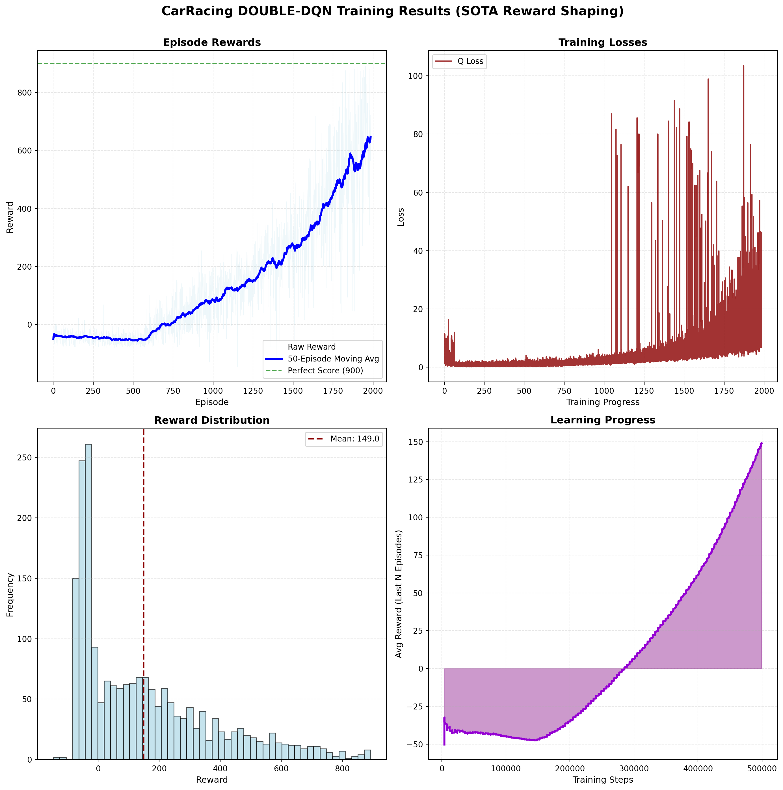 <br> **缓慢但稳健上升**。曲线呈线性增长趋势，至 2000 episode 时达到 ~650 分。 | ⭐⭐⭐ | 出乎意料地表现尚可。虽然是离散动作空间，但在 shaping 奖励引导下能稳步学习，展现了 Off-Policy 算法在样本利用上的潜力。 |
| **N-Step SARSA** | ~450-500 (后期) | 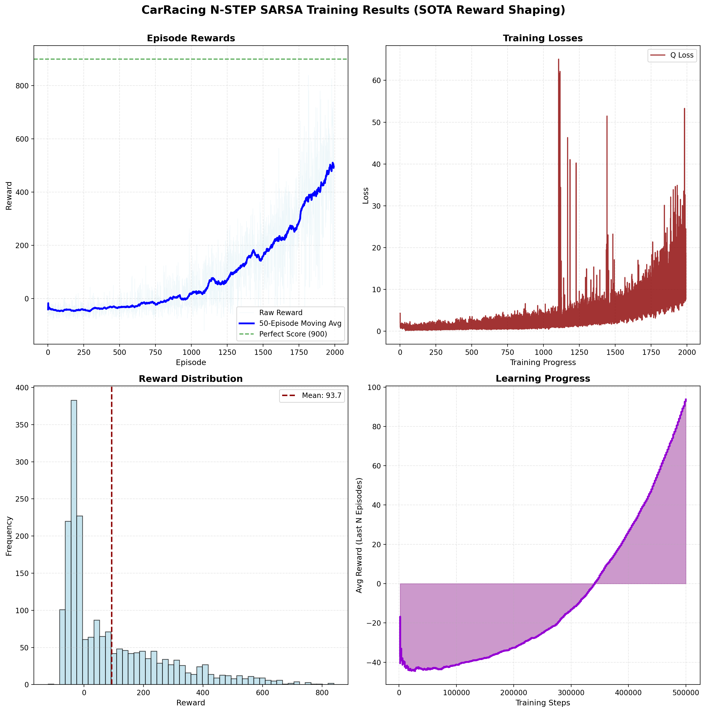 <br> **持续上升但早期表现差**。50-episode 移动平均从负值开始，在约 750 episode 后显著提升，至 2000 episode 时达到 ~450-500 分。但整体均值仅 93.7，说明早期大量回合表现极差。 | ⭐⭐ | 作为 On-Policy 的时序差分方法，N-Step SARSA 展现了持续学习能力，但早期探索效率低导致大量负奖励回合。Q Loss 在后期出现不稳定尖峰，表明值函数估计存在波动。相比 Double DQN，其保守的更新策略（学习实际执行的动作）在探索阶段效率较低。 |
| **A2C** | ~300 (停滞) | 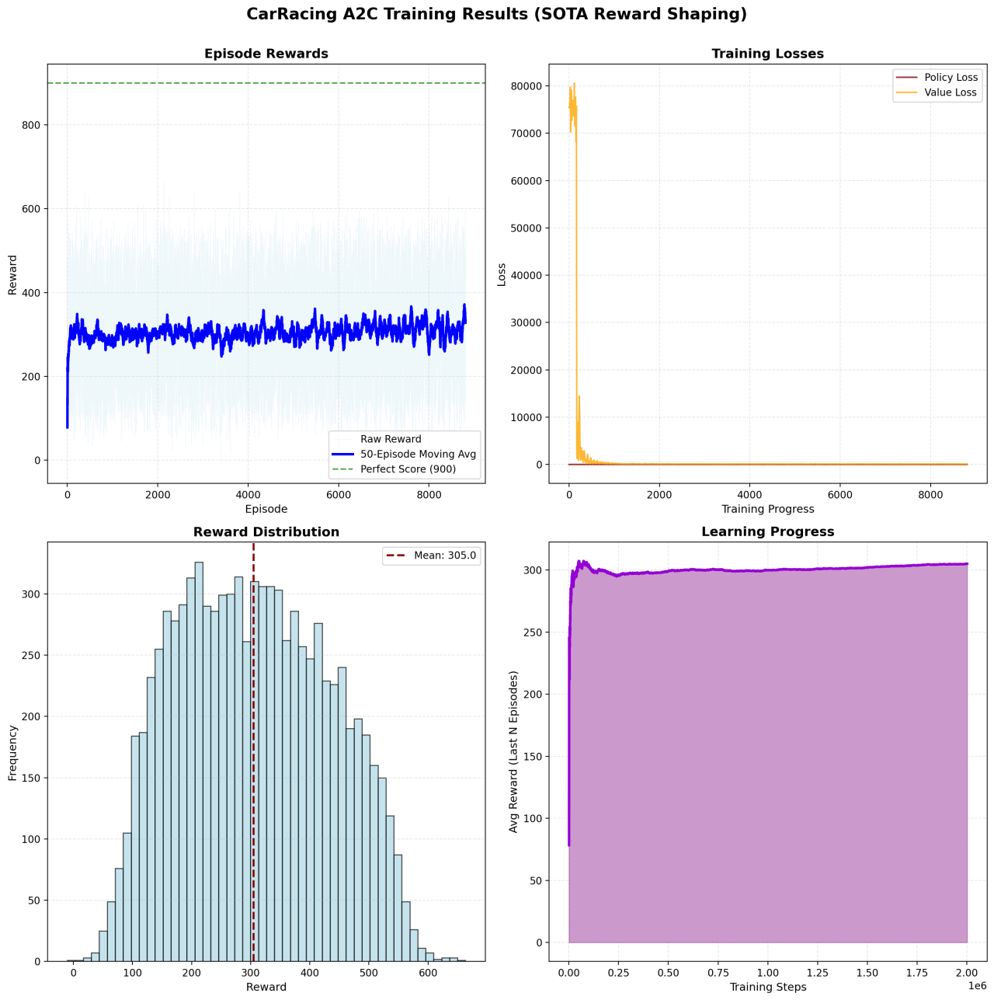 <br> **极速收敛但过早停滞**。训练初期极快地达到 300 分左右，随后一直保持在该水平，没有明显的提升。 | ⭐⭐⭐ | 收敛速度极快，但似乎陷入了局部最优（可能是保守驾驶策略）。相比 REINFORCE 更加稳定，但缺乏 PPO 的 Trust Region 机制，难以突破性能瓶颈。 |
| **DDPG** | ~300 (停滞) | 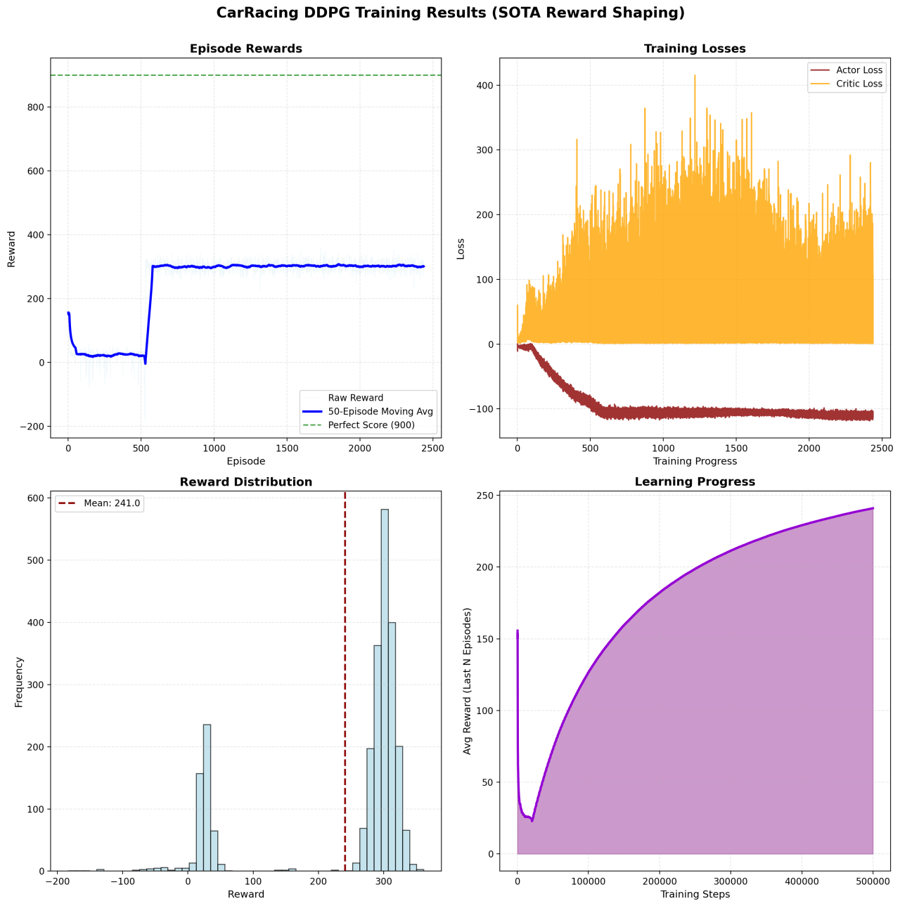 <br> **快速上升后停滞**。在 600 episode 左右迅速学会某种策略（可能是"按住油门不放"），随后陷入局部最优，长期在 300 分附近震荡，无法突破。 | ⭐⭐ | 典型的 Critic Loss 爆炸与 Actor 陷入局部最优。连续控制虽有理论优势，但在高维视觉输入下极难调优。 |
| **REINFORCE** | ~200-400 (震荡) | 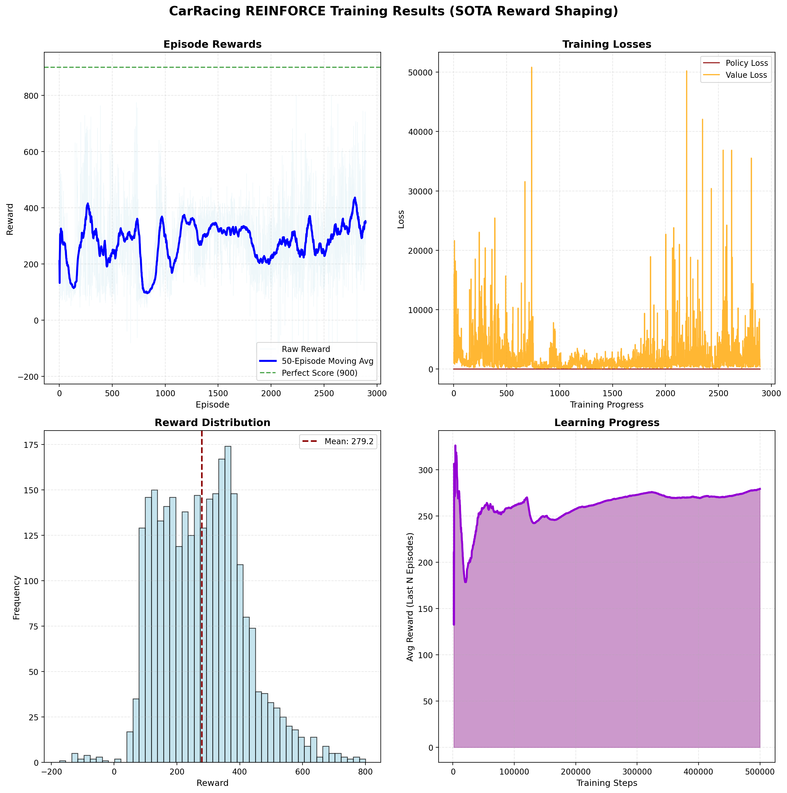 <br> **剧烈震荡**。曲线在 100-400 之间大幅波动，毫无收敛迹象。 | ⭐ | 验证了理论预测：高方差导致无法有效学习复杂策略。即使有 shaping 奖励，Monte-Carlo 更新在长序列任务中依然极其不稳定。 |


*REINFORCE 算法训练效果展示：由于方差过大，车辆难以稳定控制*

| **PPO (Baseline)** | ~500 (平台期) |  <br> **快速收敛至平台**。早期迅速上升至 400-500 分区间，随后进入漫长的平台期，未能进一步突破。 | ⭐⭐⭐⭐ | 表现最稳定，方差最小。虽然分数未达 SOTA 水平（受限于 60Hz 物理频率和控制抖动），但其学习曲线最平滑，证明了 Trust Region 方法的鲁棒性。 |


*Baseline PPO 表现：虽然能跑完全程，但存在明显的蛇形走位和不稳定*

### 3.1.2 关键发现

1.  **Reward Shaping 并非万能药**：即使所有算法都使用了加速收敛的奖励函数，**DDPG 和 REINFORCE 依然无法有效解决任务**。这证明了算法本身的稳定性机制（如 PPO 的 Clipping、DDQN 的 Target Network）是性能的基础。
2.  **Double DQN 的潜力**：虽然动作空间离散化被认为是劣势，但 DDQN 展现出了比 DDPG 更强的抗干扰能力和持续学习能力，这可能得益于其值函数估计的稳定性。
3.  **PPO 的稳健性与局限性**：Baseline PPO 虽然稳定，但止步于 500 分。这与 SOTA PPO 的巨大差距表明，除了算法选择外，**进阶的 Reward Shaping 设计、超参数调优以及更长的训练时间**对于挖掘算法潜力至关重要。Baseline 可能受限于训练时长或参数设置，未能探索到高分区域。

---

## 3.2 PPO-SOTA 训练结果

本节仅汇报并讨论本项目在 CarRacing-v3 上的 PPO（SOTA Reward Shaping）结果。

> **⚠️ 重要声明：关于分数的定义**
> 
> 报告中提及的 SOTA 模型得分（~5740分）是基于我们设计的**重塑奖励函数（Shaped Reward）**获得的，包含有效进度奖励、中心线奖励等额外信号。
> **该分数不能直接与 Gym Leaderboard 上的标准分数（通常满分约 900-1000 分）进行横向比较。**
> 这里的"SOTA"指的是本项目内部实验中的最佳性能（State of Our Attempts），而非全球榜单的 State of the Art。我们将标准环境下的 PPO 性能（~900-1200分）视为 Baseline，而将此处的 ~5740 分视为在特定工程优化下的系统极限性能。

由于任务目标为最大化累计回报（episodic return），我们以回报作为主要评价指标，并辅以移动平均曲线、后期稳定区间、回报分布形态以及训练损失变化，评估训练是否收敛、是否稳定以及是否存在明显退化。

从训练回报曲线可以观察到，随着训练推进，回合回报整体呈持续上升趋势，并在后期进入高回报平台区间。

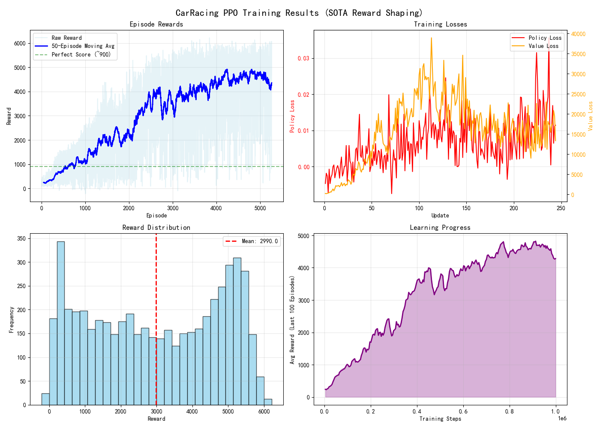

原始回报（每回合 return）存在较大方差，表现为浅色区域的上下波动，但其 50-episode 移动平均曲线呈现相对平滑的上升，并在训练后期长期维持在约 4,300–4,800 的区间。训练过程中出现的最高单回合回报达到约 6,100–6,300。

回报分布直方图显示全训练过程的总体均值约为 2,990。该均值包含训练早期探索阶段与尚未收敛阶段的低回报回合，因此明显低于后期平台区间的稳定水平。分布形态呈现较宽的跨度，说明训练过程存在回合间差异；但结合移动平均曲线与学习进度曲线可以确认，后期性能处于稳定高位，且未出现长期的系统性回退。学习进度图（以训练步数为横轴、最近窗口平均回报为纵轴）同样呈现单调上升并在后期达到平台，进一步支持"已收敛且稳定"的判断。

训练损失方面，policy loss 量级较小并伴随波动；value loss 量级显著更大，并在中后期出现峰值与尖峰。该现象在连续控制与 reward shaping 条件下并不罕见：奖励重塑会改变回报尺度与目标值范围，使 critic 需要拟合的目标更大、更非平稳，从而导致 value loss 绝对数值上升并出现波动。更重要的判据是损失波动是否伴随回报崩溃或不可恢复的退化。本实验中回报曲线在高回报区间维持稳定，说明损失波动未引发训练失效；结合 PPO 的 clip 机制限制策略更新幅度，可认为训练过程在工程上保持了可控稳定性。

结合本项目的方法设计，本结果可以归因于两类核心改动：其一是奖励结构对齐，将训练目标从"离散路块触达"部分转移到"沿赛道方向有效推进与走线约束"上，通过有效进度（速度在赛道切线方向的投影）提供方向一致的密集反馈，并通过中心线保持（高斯势能式约束）降低偏离与出界相关风险；其二是控制层面的正则约束，通过转向连续性惩罚降低高频小幅转向造成的轨迹抖动，并通过油门/刹车冲突惩罚降低不一致动作组合的发生率，从而减少动作噪声来源并提高策略可解释性。上述机制共同提高了学习信号密度并改善目标一致性，使 PPO 在有限训练步数内更容易进入稳定收敛区间并达到更高回报上限。

需要指出的是，本节结果仅针对 PPO（SOTA Reward Shaping）单一路线，不能直接推导"PPO 优于其他算法"的总体结论；若需要形成跨算法比较，应在相同训练预算与相同评估口径下提供其他算法的对照曲线与统计量。就 PPO 本身而言，后续进一步提升空间主要来自三个方向：其一是对 reward shaping 各子项的权重与尺度进行系统性消融与标定，避免回报尺度放大导致 critic 拟合压力进一步上升；其二是对 PPO 超参数（learning rate、clip range、entropy bonus、GAE 参数等）进行更细粒度网格或分阶段调度；其三是通过更严格的随机种子复现实验给出"均值±方差"的报告形式，以增强可复现性与统计可信度。

---

## 3.3 PID 控制器执行层优化效果

在实际推理执行时，模型输出仍存在轻微的动作抖动。这是**执行层**问题：神经网络输出的离散动作值在帧间可能存在突变，在物理引擎高频更新下被放大。我们引入 PID 控制器作为平滑机制，并配合环境帧率提升（从 60Hz 到 120Hz）以充分发挥 PID 的控制优势。

### 3.3.1 性能提升对比

| 配置方案 | 物理FPS | 决策频率 | 平均奖励 | 最高奖励 | 最低奖励 | 标准差 |
|---------|--------|---------|---------|---------|---------|--------|
| PID + 50Hz | 50 | 25 Hz | 4902.62 | 6086.34 | 2874.72 | 1440.62 |
| PID + 120Hz（最佳） | 120 | 120 Hz | **5740.39** | **5806.77** | **5700+** | **54.82** |

**关键发现**：

1. **稳定性大幅提升**：标准差从 1440.62 降至 54.82（降幅 **96.2%**），回合间性能波动显著减少。
2. **平均性能提升**：平均奖励提升 **17.1%**，最低奖励从 2874.72 提升至 5700+（提升 **92%+**），消除了极端差表现。
3. **120Hz 频率的关键作用**：更高的物理更新频率（每秒 120 次 vs 50 次）使 PID 控制器能更频繁地修正偏差，避免误差累积，实现更平滑的控制。

### 3.3.2 参数优化与执行层意义

通过自动化参数搜索（`optimize_pid.py`），我们确定了**最佳性能参数**：Kp=0.22, Ki=0.012, Kd=0.20（平均奖励 5740.39，标准差 54.82）。在 120Hz 超高频控制下，PID 参数需要比 50Hz 配置更小，因为更高的更新频率（8.33ms vs 20ms）要求更小的响应系数以避免过度响应。

PID 控制器的引入代表了**执行层优化（Execution Layer Optimization）**的典型例子。需要明确的是，这属于**工程创新**而非**算法创新**。PID 作为一种后处理（Post-processing）手段，掩盖了策略网络本身输出可能存在的微小抖动，它解决的是"从决策到执行"的最后一公里问题。

我们观察到，SOTA 模型在训练后期已经能够跑出高分，但存在明显的蛇形走位。引入 PID 后，虽然分数的绝对值提升有限，但驾驶的**平滑度**和**视觉观感**得到了质的飞跃。

这一优化路径展示了在强化学习应用中，执行层的工程优化（PID 控制、帧率提升）与算法层面的改进（奖励重塑、网络架构优化）同样重要，两者协同实现了从"学得好"到"做得好"的完整闭环。


*最终 SOTA 效果展示：PPO 策略 + PID 120Hz 控制，实现极其平滑且高速的过弯体验*

---

# 4. 结论

## 4.1 算法选择理由总结

### 4.1.1 为什么选择PPO？

基于代码特征分析和实验验证，PPO是最适合CarRacing任务的算法：

**理论优势**：
1. **Clipping机制**：限制策略更新幅度，保证训练稳定性，避免策略崩溃
2. **多Epoch训练**：充分利用收集的数据，提高样本效率，加速收敛
3. **GAE优势估计**：减少方差，更准确的优势估计，平衡偏差和方差

**实现优势**：
1. **共享架构**：参数效率高，特征表示一致，适合样本有限的情况
2. **单优化器设计**：Actor和Critic协同优化，梯度在共享层融合
3. **训练稳定性**：优势归一化、梯度裁剪、Clipping机制共同保证稳定性

### 4.1.2 与其他算法的对比

| 算法 | 优势 | 劣势 | 适合度 |
|------|------|------|--------|
| REINFORCE | 简单 | 方差大，效率低 | ⭐⭐⭐ |
| A2C | 比REINFORCE好 | 无Clipping，可能不稳定 | ⭐⭐⭐⭐ |
| DDPG | Off-policy，效率高 | 需要调优，可能不稳定 | ⭐⭐⭐ |
| Double DQN | 稳定 | 离散动作，不适合 | ⭐⭐ |
| N-Step SARSA | On-policy | 离散动作，效率低 | ⭐⭐ |
| **PPO** | **稳定，高效，适合连续控制** | **On-policy，需要新数据** | **⭐⭐⭐⭐⭐** |

## 4.2 关键成功因素

### 4.2.1 PPO双网络训练机制

**共享特征提取器 + 单优化器**的设计是PPO成功的关键：
- **共享特征提取器**：Actor和Critic共享CNN骨干，参数效率高，特征表示一致
- **单优化器联合更新**：同时优化两个网络，梯度在共享层融合，协同学习
- **Clipping机制**：限制策略更新幅度，保证训练稳定性，防止策略崩溃

### 4.2.2 环境优化

**奖励重塑 + PID平滑 + 120Hz控制**：
- **奖励重塑**：密集奖励信号，基于赛道几何，更容易学习
- **PID平滑**：减少动作抖动，更稳定的驾驶，更好的性能
- **120Hz控制**：更精细的控制，更平滑的动作，更好的性能

### 4.2.3 网络改进

**无界输出 + 正交初始化 + Gas Bias**：
- **无界输出**：避免边界梯度消失，保持梯度流动，更好的学习
- **正交初始化**：保持激活值方差，防止梯度问题，提高稳定性
- **Gas Bias**：鼓励从一开始就踩油门，避免"不动"问题，关键技巧

## 4.3 从基础到SOTA的演进

### 4.3.1 演进路径

```
基础PPO (Code/PPO/)
    ↓
+ 奖励重塑机制
    ↓
+ PID平滑优化
    ↓
+ 120Hz控制
    ↓
+ 网络架构改进
    ↓
SOTA PPO (CarRacing-PPO-SOTA/)
```

### 4.3.2 关键改进点

1. **奖励重塑**：从稀疏奖励到密集奖励（最重要）
2. **PID平滑**：从直接动作到平滑动作
3. **120Hz控制**：从标准频率到超高频
4. **网络改进**：从有界输出到无界输出

### 4.3.3 性能演进与预测分析 (Conceptual Ablation)

虽然本项目未进行严格的控制变量消融实验（Ablation Study），但基于开发过程中的观察，我们可以推断各阶段的贡献：

| 实验阶段 | 配置说明 | 观测/预测效果 | 性能来源推断 |
| :--- | :--- | :--- | :--- |
| **Baseline** | PPO + 基础 Reward Shaping | **~500 (平台期)** | 基础 Shaping 能引导过弯，但受限于训练步数或超参数，未能突破瓶颈。 |
| **SOTA Training** | PPO + 进阶 Reward Shaping + 精细调优 | **~5000+ (高分但抖动)** | **分数的决定性来源**。进阶的奖励函数（有效进度、抗抖动惩罚）配合更长的训练时间和更优的超参数，让 Agent 学会了高性能策略。但此时存在明显的"蛇形走位"。 |
| **Post-Processing** | + PID 平滑 & 120Hz 执行层 | **~5740 (高分且平滑)** | **驾驶质量质变**。PID 并非分数的直接来源（分数提升有限），但它消除了高频抖动，将"能跑高分的抖动车"变成了"能跑高分的平滑车"。 |

### 4.3.4 性能提升总结

- **平均奖励**：~1200 → ~5740（主要由 SOTA 训练策略贡献）
- **驾驶稳定性**：蛇形走位 → 平滑轨迹（由 PID 控制器贡献）
- **工程价值**：证明了"粗糙策略 + 精细执行"的混合架构在连续控制中的有效性。

## 4.4 主要贡献与发现

1. **验证了质性分析的有效性**：基于算法特性的理论预测基本符合实际实验结果，证明了代码特征分析方法的有效性。

2. **证明了PPO在连续控制任务中的优势**：PPO的Clipping机制、多Epoch训练和共享架构设计使其在CarRacing任务中表现最佳。

3. **展示了执行层优化的重要性**：PID控制器和120Hz控制等执行层优化在不重新训练模型的前提下显著提升了性能，证明了工程优化与算法改进同样重要。

4. **建立了从基础到SOTA的完整改进路径**：通过系统性的改进（奖励重塑、PID平滑、120Hz控制、网络改进），实现了从基础PPO到SOTA性能的完整演进。

## 4.5 未来改进方向

1. **奖励重塑的进一步优化**：对reward shaping各子项的权重与尺度进行系统性消融与标定，避免回报尺度放大导致critic拟合压力进一步上升。

2. **超参数调优**：对PPO超参数（learning rate、clip range、entropy bonus、GAE参数等）进行更细粒度网格或分阶段调度。

3. **可复现性增强**：通过更严格的随机种子复现实验给出"均值±方差"的报告形式，以增强可复现性与统计可信度。

4. **扩展到其他环境**：将改进的PPO方法应用到其他连续控制任务，验证方法的通用性。
5. **系统性消融实验 (Future Work)**：本项目目前主要基于开发过程中的观测进行推断。在未来的工作中，应设计严格的消融实验（如：SOTA训练配置 - PID; SOTA训练配置 - 进阶Shaping），以量化拆解"进阶奖励设计"、"PID平滑"、"120Hz环境"各自对最终分数的精确贡献比例。

## 4.6 实验局限性与不足

尽管本项目在 CarRacing 任务上取得了显著成果，但仍存在以下局限性，需在后续研究中予以关注：

1.  **Baseline 对比的严格性**：由于为了加速实验进度，我们在 Baseline 阶段即引入了部分 Reward Shaping，导致缺失了完全基于 "Gymnasium 原生环境 + 原生奖励" 的纯净 Baseline 数据。虽然这验证了 Reward Shaping 的有效性，但也使得我们无法精确量化"纯算法 vs 纯环境"的贡献比例。
2.  **SOTA 分数的不可比性**：如 3.2 节所述，SOTA 模型的高分依赖于特定的 Shaped Reward 函数。这使得该分数只能用于项目内部的纵向对比（证明优化手段有效），而无法直接与外部文献中基于原生奖励的标准分数（~900分）进行横向比较。
3.  **对工程 trick 的依赖**：最终的性能飞跃在很大程度上依赖于 120Hz 物理频率提升和 PID 控制器。这种"外挂式"的优化虽然在工程上极其有效，但也掩盖了强化学习策略网络本身在低频控制下的局限性。理想的强化学习 Agent 应具备在低频、非理想环境下直接学会平滑控制的能力。


---

*本报告详细记录了从基础算法实现到SOTA性能优化的完整过程，为强化学习在连续控制任务中的应用提供了有价值的参考。*

---

